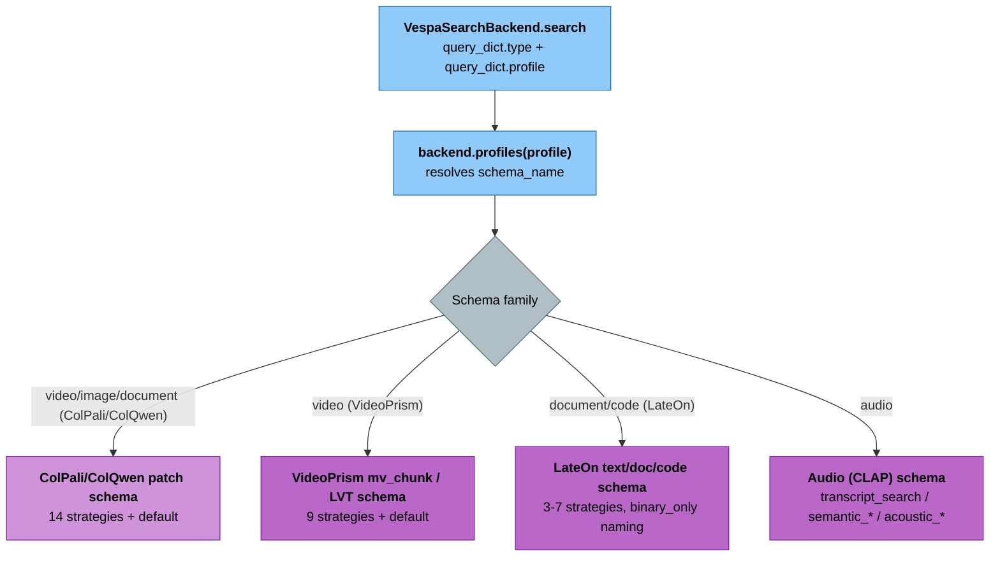

# Vespa Search Strategies

**Package**: cogniverse-vespa (Implementation Layer)
**Related**: cogniverse-core (backend configuration)

This document describes the 14 ranking strategies available on the ColPali/ColQwen patch-based schemas (video, image, and visual-document search) in the Vespa search backend — the richest and most commonly used strategy set. These strategies are implemented in the `cogniverse-vespa` package and configured through the backend profile system in `cogniverse-core`. Other schema families (VideoPrism, LateOn text/code, audio, knowledge graph) implement overlapping but smaller strategy sets, some under different names — see [Schema Family Coverage](#schema-family-coverage) below.

## Strategy Categories

### Text-Only Search
**Strategy**: `bm25_only`
- **Purpose**: Pure text search using BM25 algorithm
- **Fields**: Searches across video_title, segment_description (ColPali schemas only), audio_transcript
- **Requirements**: Text query only
- **Speed**: Fast
- **Use Case**: Text-heavy queries, document search

**Strategy**: `bm25_no_description` (ColPali/ColQwen schemas only)
- **Purpose**: Pure text search excluding segment descriptions
- **Fields**: Searches across video_title and audio_transcript only
- **Requirements**: Text query only
- **Speed**: Fast
- **Use Case**: When segment descriptions are unreliable or unavailable

### Visual Search
**Strategy**: `float_float`
- **Purpose**: Highest accuracy visual search
- **Method**: Float embeddings with direct similarity
- **Requirements**: Visual embeddings
- **Speed**: Slowest
- **Use Case**: Maximum visual precision needed

**Strategy**: `binary_binary`
- **Purpose**: Fastest visual search
- **Method**: Binary embeddings with Hamming distance
- **Requirements**: Visual embeddings (binary)
- **Speed**: Fastest
- **Use Case**: Speed-critical visual search

**Strategy**: `float_binary`
- **Purpose**: Balanced speed/accuracy
- **Method**: Float query with binary storage using unpack_bits
- **Requirements**: Visual embeddings
- **Speed**: Fast
- **Use Case**: Good balance of speed and accuracy

**Strategy**: `phased`
- **Purpose**: Optimized retrieval with reranking
- **Method**: Binary first phase, float reranking
- **Requirements**: Both binary and float embeddings
- **Speed**: Fast
- **Use Case**: High accuracy with optimized performance

### Hybrid Search (Text + Visual)
**Strategy**: `hybrid_float_bm25`
- **Purpose**: Best overall accuracy
- **Method**: Float embedding first phase, BM25 reranking
- **Requirements**: Text query + visual embeddings
- **Speed**: Slow
- **Use Case**: Complex queries with both visual and text components

**Strategy**: `hybrid_binary_bm25`
- **Purpose**: Fast hybrid search
- **Method**: Binary embedding first phase, BM25 reranking
- **Requirements**: Text query + visual embeddings (binary)
- **Speed**: Fast
- **Use Case**: Fast hybrid search for visual+text queries

**Strategy**: `hybrid_bm25_binary`
- **Purpose**: Text-first with visual validation
- **Method**: BM25 first phase, binary visual reranking
- **Requirements**: Text query + visual embeddings (binary)
- **Speed**: Fast
- **Use Case**: Text-heavy queries with visual validation

**Strategy**: `hybrid_bm25_float`
- **Purpose**: Text-first with precise reranking
- **Method**: BM25 first phase, float visual reranking
- **Requirements**: Text query + visual embeddings
- **Speed**: Medium
- **Use Case**: Text-heavy queries with precise visual reranking

### No-Description Variants (ColPali/ColQwen schemas only)
**Strategy**: `hybrid_float_bm25_no_description`
- **Purpose**: Hybrid search excluding frame descriptions
- **Method**: Float embedding + BM25 on video_title and audio_transcript only
- **Requirements**: Text query + visual embeddings
- **Speed**: Slow
- **Use Case**: When frame descriptions are unreliable

**Strategy**: `hybrid_binary_bm25_no_description`
- **Purpose**: Fast hybrid without descriptions
- **Method**: Binary embedding + BM25 on title and transcript only
- **Requirements**: Text query + visual embeddings (binary)
- **Speed**: Fast
- **Use Case**: Fast hybrid without frame descriptions

**Strategy**: `hybrid_bm25_binary_no_description`
- **Purpose**: Text-first without descriptions
- **Method**: BM25 on title/transcript, binary visual reranking
- **Requirements**: Text query + visual embeddings (binary)
- **Speed**: Fast
- **Use Case**: Text-first search excluding descriptions

**Strategy**: `hybrid_bm25_float_no_description`
- **Purpose**: Text-first without descriptions, precise reranking
- **Method**: BM25 on title/transcript, float visual reranking
- **Requirements**: Text query + visual embeddings
- **Speed**: Medium
- **Use Case**: Text-first with precise visual reranking, no descriptions

## Schema Family Coverage

The 14 strategy names above are not implemented identically by every schema — each family's `rank_profiles` are generated independently, so coverage and naming diverge. `RankingStrategyExtractor` (see [Strategy Extraction & Runtime Resolution](#strategy-extraction--runtime-resolution)) reads whatever profiles the deployed schema actually declares, so unlisted strategies simply are not selectable for that schema.

| Schema family | Example profiles (`backend.profiles`) | Strategy set |
|---|---|---|
| ColPali/ColQwen patch (has description field) | `video_colpali_smol500_mv_frame`, `image_colpali_mv`, `video_colqwen_omni_mv_chunk_30s`, `document_visual_colpali` | All 14 strategies + `default` (15 rank profiles) |
| VideoPrism mv_chunk / LVT sv_chunk (no description field) | `video_videoprism_base_mv_chunk_30s`, `video_videoprism_large_mv_chunk_30s`, `video_videoprism_lvt_base_sv_chunk_6s`, `video_videoprism_lvt_large_sv_chunk_6s` | 9 of the 14 (`bm25_only`, `float_float`, `binary_binary`, `float_binary`, `phased`, `hybrid_float_bm25`, `hybrid_binary_bm25`, `hybrid_bm25_binary`, `hybrid_bm25_float`) + `default`; `bm25_no_description` and all `*_no_description` hybrids are absent because there is no description field to exclude |
| LateOn text (`document_text` schema) | `document_text_semantic` | 7 of the 14 (`bm25_only`, `float_float`, `binary_binary`, `float_binary`, `phased`, `hybrid_float_bm25`, `hybrid_binary_bm25`) + `default`; no `hybrid_bm25_binary`/`hybrid_bm25_float` or `*_no_description` variants |
| LateOn document (`lateon_mv` schema) | `lateon_mv` | `bm25_only`, `float_float`, `float_binary`, `hybrid_binary_bm25`, `hybrid_float_bm25` + `default`; the visual-search-only strategy is named `binary_only`, **not** `binary_binary` |
| LateOn code (`code_lateon_mv` schema) | `code_lateon_mv` | Only 3: `float_float`, `bm25_only`, `hybrid_float_bm25` — no `default`, no binary/phased/no-description variants |
| Knowledge graph (`knowledge_graph` schema) | used internally by `GraphManager`, not exposed as a `backend.profiles` entry | `bm25_only`, `float_float`, `hybrid_binary_bm25`, `hybrid_float_bm25` + `default`; like `lateon_mv`, the binary-only strategy is named `binary_only` |
| Audio (`audio_content` schema) | `audio_clap_semantic` | Entirely different naming: `transcript_search` (BM25 on `audio_title`/`audio_transcript`), `acoustic_similarity` (CLAP acoustic embedding, `closeness()`), `semantic_float`/`semantic_binary` (ColBERT-style token embeddings), `phased_semantic`, `hybrid_semantic_bm25`, `hybrid_acoustic_bm25` + `default` |



## Usage Guidelines

### Query Type Analysis
- **Text-only queries**: Use `bm25_only`
- **Visual queries**: Use `float_float` (accuracy) or `binary_binary` (speed)
- **Combined queries**: Use `hybrid_float_bm25` (accuracy) or `hybrid_binary_bm25` (speed)

### Speed vs Accuracy Trade-offs
- **Maximum accuracy**: `hybrid_float_bm25`, `float_float`
- **Maximum speed**: `binary_binary`, `hybrid_binary_bm25`
- **Balanced**: `float_binary`, `hybrid_bm25_float`

### Field Configuration
All BM25 strategies use fieldsets to search across:

- `video_title`: Video file names and metadata

- `segment_description`: Generated visual descriptions (ColPali schemas only - VideoPrism schemas do not include description fields)

- `audio_transcript`: Transcribed audio content

**Note**: Different schemas use different field names and available fields. ColPali schemas use `segment_description` and `segment_id`. VideoPrism schemas use `segment_id` but have no description field. `VespaSearchBackend` handles these variations automatically.

## Technical Implementation

### BM25 Fieldsets
- **Fieldset name**: `default`
- **Fields**: `video_title`, `segment_description` (ColPali schemas only), `audio_transcript`
- **Query method**: `VespaSearchBackend._build_query` emits YQL `userInput(@userQuery)`, which Vespa resolves against the schema's `default` fieldset; strategies without a text component build filter-only or `nearestNeighbor(...)` YQL instead. The rank profile's `first-phase`/`second-phase` expression then sums `bm25(field)` per fieldset member (e.g. `bm25_only` is `bm25(video_title) + bm25(segment_description) + bm25(audio_transcript)`) rather than relying on a single `model.defaultIndex` override.
- **Note**: VideoPrism schemas exclude segment_description from the fieldset as they do not generate descriptions

### Embedding Types
- **Multi-vector float** (ColPali/ColQwen, VideoPrism mv_chunk): `tensor<bfloat16>(patch{}, v[D])` where D is embedding dimension (320 for ColPali/ColQwen via `TomoroAI/tomoro-colqwen3-embed-4b`, 768 for VideoPrism base, 1024 for VideoPrism large)
- **Multi-vector binary** (ColPali/ColQwen, VideoPrism mv_chunk): `tensor<int8>(patch{}, v[B])` where B = D/8 (40 for ColPali/ColQwen, 96 for VideoPrism base, 128 for VideoPrism large)
- **Single-vector float** (LVT sv_chunk): `tensor<float>(v[D])` where D is 768 (base) or 1024 (large) — no patch dimension
- **Single-vector binary** (LVT sv_chunk): `tensor<int8>(v[B])` where B is 96 (base) or 128 (large) — no patch dimension
- **Multi-vector token** (LateOn family — `lateon_mv`, `document_text`, `code_lateon_mv`): `tensor<bfloat16>(token{}, v[D])` where D is 128 (`lightonai/LateOn`) or 48 (`lightonai/LateOn-Code-edge`); binary counterpart `tensor<int8>(token{}, v[D/8])`

### Ranking Phases
- **First phase**: Initial candidate selection
- **Second phase**: Reranking top candidates (default: top 100, from each rank profile's `second-phase.rerank-count`)
- **Hybrid**: Different models for each phase

### Strategy Extraction & Runtime Resolution
`cogniverse_vespa.ranking_strategy_extractor.RankingStrategyExtractor` reads each schema's `rank_profiles` JSON and derives, per profile, a `RankingStrategyInfo` dataclass: `strategy_type` (`SearchStrategyType.PURE_VISUAL` / `PURE_TEXT` / `HYBRID`, inferred from whether the profile's inputs/first-phase expression reference float or int8 tensors and `bm25`/`userInput`), `needs_float_embeddings`, `needs_binary_embeddings`, `needs_text_query`, whether it uses `nearestNeighbor` (single-vector LVT schemas only — patch-based schemas rank with MaxSim over all patches instead), and the concrete embedding field name (parsed from `attribute(...)`/`closeness(field, ...)` in the profile's expressions).

Two independent consumers use this extraction:
- **Query time**: `VespaSearchBackend.search` calls `_load_ranking_strategies()` once per process and caches the result in a module-level `_RANKING_STRATEGIES_CACHE` (guarded by `_CACHE_LOCK`), keyed by base schema name. This is what validates a requested `strategy` string and builds the YQL/tensor-input query in `_build_query`.
- **Ingestion time**: `StrategyAwareProcessor` (also in `cogniverse-vespa`) loads a persisted `ranking_strategies.json` (auto-generated via `extract_all_ranking_strategies`/`save_ranking_strategies` if missing) to decide which embedding fields (`get_embedding_field_names`) and whether float and/or binary embeddings (`get_required_embeddings`) a document needs to be written with for its schema, independent of the search-time cache.

## Architecture Integration

### Package Roles
- **cogniverse-vespa** (Implementation Layer): Implements ranking-strategy extraction and query building in `VespaSearchBackend` (and the higher-level `VespaBackend`) — up to 14 strategies per schema, depending on schema family (see [Schema Family Coverage](#schema-family-coverage))
- **cogniverse-core** (Core Layer): Manages backend configuration and profile selection
- **cogniverse-foundation** (Foundation Layer): Provides configuration management and telemetry interfaces

### Configuration
Backend profiles are configured in system config files. Ranking strategies are selected at query time, not in the config:
```json
{
  "backend": {
    "type": "vespa",
    "profiles": {
      "video_colpali_smol500_mv_frame": {
        "type": "video",
        "schema_name": "video_colpali_smol500_mv_frame",
        "embedding_model": "TomoroAI/tomoro-colqwen3-embed-4b",
        "schema_config": {
          "embedding_dim": 320,
          "binary_dim": 40
        }
      }
    }
  }
}
```

Ranking strategy is specified in the search query as a plain
rank-profile-name string under the `strategy` key:
```python
results = backend.search({
    "query": "person walking",
    "type": "video",
    "profile": "video_colpali_smol500_mv_frame",
    "strategy": "hybrid_float_bm25",
    "top_k": 10,
    "tenant_id": "your_org:production",
})
```

### Multi-Modal Support
`query_dict["type"]` is matched against each profile's `type` value (`cogniverse_sdk.document.ContentType` enumerates VIDEO, AUDIO, IMAGE, TEXT, DATAFRAME, DOCUMENT, but the field is a plain string — `backend.profiles` also declares a `code` type for `code_lateon_mv` that is outside the enum). Coverage per type, using the strategy set that schema family actually implements (see [Schema Family Coverage](#schema-family-coverage)):

- VIDEO: Frame/chunk-level visual search with temporal context — ColPali/ColQwen (14 strategies) or VideoPrism (9 strategies)

- AUDIO: Transcript search (`transcript_search`, BM25) plus CLAP acoustic and ColBERT-style semantic embedding strategies — named differently from the 14-strategy set

- IMAGE: Visual embedding search via ColPali/ColQwen (`image_colpali_mv`, full 14-strategy set)

- DOCUMENT: Visual (ColPali page-as-image, `document_visual_colpali`) or text (LateOn, `document_text_semantic`/`lateon_mv`, reduced strategy set) search, or hybrid of both

- CODE: LateOn-Code-edge token embeddings (`code_lateon_mv`) — only `float_float`, `bm25_only`, `hybrid_float_bm25`

- TEXT / DATAFRAME: `ContentType` values exist for these but no `backend.profiles` entry in `configs/config.json` currently targets them; a schema deployed for either type would resolve strategies the same way as the other families above

## Performance Characteristics (Estimated)

<!-- TODO: Benchmark and update with actual measured performance -->

| Strategy | Response Time* | Memory Usage | Accuracy |
|----------|----------------|--------------|----------|
| `bm25_only` | ~50ms | Low | Text-only |
| `binary_binary` | ~100ms | Medium | Good |
| `float_float` | ~300ms | High | Highest |
| `hybrid_float_bm25` | ~350ms | High | Highest |
| `hybrid_binary_bm25` | ~150ms | Medium | Good |

*Estimated values - actual performance varies based on index size, hardware, and query complexity

## Strategy Selection

### Specifying a Strategy
Ranking strategies are plain rank-profile-name strings, validated against
the deployed schema. Pass the chosen string as the `strategy` key of the
`query_dict` you hand to `VespaSearchBackend.search`:

```python
from pathlib import Path

from cogniverse_core.schemas.filesystem_loader import FilesystemSchemaLoader
from cogniverse_foundation.config.utils import create_default_config_manager
from cogniverse_vespa.search_backend import VespaSearchBackend

# create_default_config_manager() reads BACKEND_URL/BACKEND_PORT env vars
# and configs/config.json; schema_loader points at the deployed schema JSONs.
config_manager = create_default_config_manager()
schema_loader = FilesystemSchemaLoader(Path("configs/schemas"))

backend = VespaSearchBackend(
    config={
        "url": "http://localhost",
        "port": 8080,
        "profiles": {"video_colpali_smol500_mv_frame": {}},
        "default_profiles": {"video": "video_colpali_smol500_mv_frame"},
    },
    config_manager=config_manager,
    schema_loader=schema_loader,
)

results = backend.search({
    "query": "your query",
    "type": "video",
    "profile": "video_colpali_smol500_mv_frame",
    "strategy": "hybrid_float_bm25",
    "top_k": 10,
    "tenant_id": "your_org:production",
    # "query_embeddings": <numpy array> for visual/hybrid strategies
})
```

If `strategy` is omitted, the backend resolves a default rank profile for
the content type.

### Choosing the Right Strategy
Choose based on:
1. **Query type**: Text, visual, or hybrid
2. **Speed requirements**: Real-time vs batch processing
3. **Accuracy needs**: Good enough vs maximum precision
4. **Resource constraints**: Memory and compute limitations

## Related Tests
- `tests/runtime/integration/test_ranking_strategies_real.py` — real-Vespa, real-ColPali (vLLM sidecar) integration test that drives every one of the 14 `video_colpali_smol500_mv_frame` rank profiles through `VespaSearchBackend.search` and asserts non-empty, descending-ranked results.
- `tests/backends/unit/test_ranking_strategy_extractor.py` — regression tests for `RankingStrategyExtractor`: schema-name resolution when a schema JSON is keyed by `name` instead of `schema`, and `nearestNeighbor` enablement for `_lvt_` single-vector schemas.
