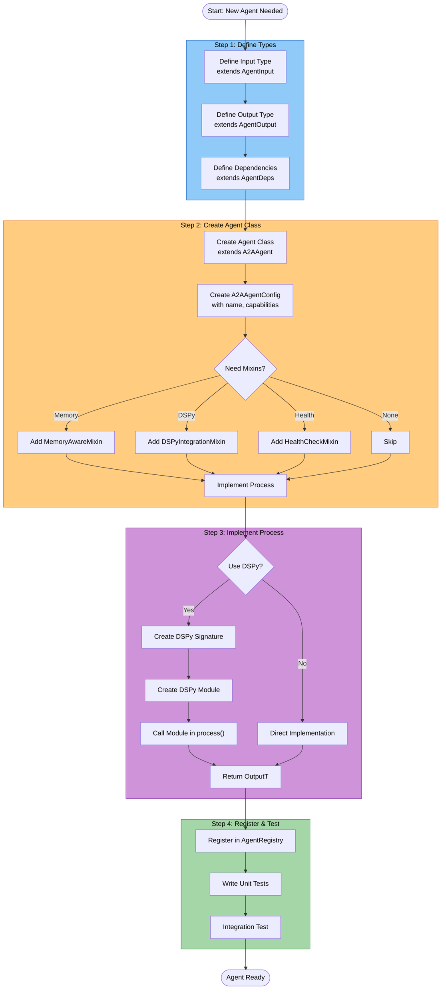

# Tutorial: Creating a Custom Agent

This tutorial walks you through creating a custom agent from scratch, covering type-safe generics, A2A protocol integration, DSPy modules, and testing.

---

## Table of Contents

1. [Overview](#overview)
2. [Step 1: Define Input/Output Types](#step-1-define-inputoutput-types)
3. [Step 2: Define Dependencies](#step-2-define-dependencies)
4. [Step 3: Create the Agent Class](#step-3-create-the-agent-class)
5. [Step 4: Implement the Process Method](#step-4-implement-the-process-method)
6. [Step 5: Add DSPy Module](#step-5-add-dspy-module)
7. [Step 6: Register the Agent](#step-6-register-the-agent)
8. [Step 7: Write Tests](#step-7-write-tests)
9. [Complete Example](#complete-example)

---

## Overview

Cogniverse agents are built on a type-safe foundation:

```text
AgentBase[InputT, OutputT, DepsT]  # Generic base class
    └── A2AAgent[InputT, OutputT, DepsT]  # A2A protocol + DSPy
            └── YourCustomAgent  # Your implementation
```

### Agent Creation Flowchart



By the end of this tutorial, you'll have created a `SummarizationAgent` that:

- Accepts text content and summarization parameters

- Uses a DSPy module for LLM-driven summarization

- Returns structured summaries with confidence scores

- Is fully type-safe with IDE autocomplete support

---

## Step 1: Define Input/Output Types

First, define what your agent receives and returns. These must extend `AgentInput` and `AgentOutput`.

```python
# libs/agents/cogniverse_agents/summarization/types.py

from cogniverse_core.agents.base import AgentInput, AgentOutput
from pydantic import Field
from typing import Optional, List

class SummarizationInput(AgentInput):
    """Input for summarization agent."""

    content: str = Field(..., description="Text content to summarize")
    max_length: int = Field(default=200, description="Maximum summary length")
    style: str = Field(default="concise", description="Summary style: concise, detailed, bullet")
    focus_topics: Optional[List[str]] = Field(default=None, description="Topics to focus on")

class SummarizationOutput(AgentOutput):
    """Output from summarization agent."""

    summary: str = Field(..., description="Generated summary")
    key_points: List[str] = Field(default_factory=list, description="Key points extracted")
    confidence: float = Field(default=0.0, description="Confidence score 0-1")
    word_count: int = Field(default=0, description="Summary word count")
    style_used: str = Field(default="", description="Style applied")
    error: Optional[str] = Field(default=None, description="Error message if processing failed")
```

`★ Insight ─────────────────────────────────────`
- `AgentInput` and `AgentOutput` are Pydantic models that provide automatic validation
- Using `Field(...)` makes fields required; `Field(default=...)` makes them optional
- Type annotations enable IDE autocomplete throughout your agent code
`─────────────────────────────────────────────────`

---

## Step 2: Define Dependencies

Dependencies are services your agent needs (LLMs, backends, other agents). They're injected at runtime.

```python
# libs/agents/cogniverse_agents/summarization/types.py (continued)

from cogniverse_core.agents.base import AgentDeps
from pydantic import ConfigDict
from typing import Optional, Any
import dspy

class SummarizationDeps(AgentDeps):
    """Dependencies for summarization agent."""

    lm: Optional[dspy.LM] = None  # DSPy language model
    config_manager: Optional[Any] = None  # For configuration access
    telemetry_manager: Optional[Any] = None  # For tracing

    model_config = ConfigDict(arbitrary_types_allowed=True)  # Allow dspy.LM type
```

`★ Insight ─────────────────────────────────────`
- Dependency fields CAN be optional (like `lm`, `config_manager`), but `tenant_id` (inherited from AgentDeps) is ALWAYS REQUIRED
- Use Pydantic v2 `model_config = ConfigDict(arbitrary_types_allowed=True)` for non-Pydantic types like `dspy.LM`
- This pattern allows easy mocking in tests
`─────────────────────────────────────────────────`

---

## Step 3: Create the Agent Class

Now create the agent class extending `A2AAgent` with your generic types.

```python
# libs/agents/cogniverse_agents/summarization/agent.py

from cogniverse_core.agents.a2a_agent import A2AAgent, A2AAgentConfig
from cogniverse_agents.summarization.types import (
    SummarizationInput,
    SummarizationOutput,
    SummarizationDeps
)

class SummarizationAgent(A2AAgent[SummarizationInput, SummarizationOutput, SummarizationDeps]):
    """
    Agent that summarizes text content using LLM.

    Supports multiple styles: concise, detailed, bullet points.
    """

    def __init__(self, deps: SummarizationDeps, port: int = 8003):
        """
        Initialize summarization agent.

        Args:
            deps: Typed dependencies (must include tenant_id)
            port: A2A server port

        Raises:
            TypeError: If deps is not SummarizationDeps
            ValidationError: If deps fails Pydantic validation
        """
        # Create A2A config
        a2a_config = A2AAgentConfig(
            agent_name="summarization_agent",
            agent_description="Summarizes text content with configurable styles",
            capabilities=["text_summarization", "key_point_extraction"],
            port=port,
            version="1.0.0"
        )

        # Initialize DSPy module first
        self.summarization_module = None
        self._init_dspy_module()

        # Initialize A2A base with config and DSPy module
        super().__init__(deps=deps, config=a2a_config, dspy_module=self.summarization_module)

    def _init_dspy_module(self):
        """Initialize DSPy module for summarization."""
        # We'll implement this in Step 5
        pass
```

`★ Insight ─────────────────────────────────────`
- The type parameters `[SummarizationInput, SummarizationOutput, SummarizationDeps]` enable full type safety
- `A2AAgentConfig` contains agent metadata: name, description, capabilities, port, version
- `deps` is REQUIRED (not optional) and must include `tenant_id` for multi-tenancy
- DSPy module is initialized before calling `super().__init__()` and passed to A2A base
`─────────────────────────────────────────────────`

---

## Step 4: Implement the Process Method

Agents use a two-method pattern for processing:

- `_process_impl()` - Core logic (you implement this)

- `process()` - Public API that supports streaming (inherited from base)

The base class `process()` method handles:

- Dict-to-typed-input conversion

- Streaming vs non-streaming routing

- Input validation

```python
# libs/agents/cogniverse_agents/summarization/agent.py (continued)

from cogniverse_core.agents.a2a_agent import A2AAgent, A2AAgentConfig
from cogniverse_agents.summarization.types import (
    SummarizationInput,
    SummarizationOutput,
    SummarizationDeps
)
import logging

logger = logging.getLogger(__name__)

class SummarizationAgent(A2AAgent[SummarizationInput, SummarizationOutput, SummarizationDeps]):
    """Agent that summarizes text content using LLM."""

    def __init__(self, deps: SummarizationDeps, port: int = 8003):
        """Initialize summarization agent with typed dependencies."""
        # Create A2A config
        a2a_config = A2AAgentConfig(
            agent_name="summarization_agent",
            agent_description="Summarizes text content with configurable styles",
            capabilities=["text_summarization", "key_point_extraction"],
            port=port,
            version="1.0.0"
        )

        # Initialize DSPy module
        self.summarization_module = None
        self._init_dspy_module()

        # Initialize A2A base
        super().__init__(deps=deps, config=a2a_config, dspy_module=self.summarization_module)

    def _init_dspy_module(self):
        """Initialize DSPy module."""
        pass  # Implemented in Step 5

    async def _process_impl(self, input: SummarizationInput) -> SummarizationOutput:
        """
        Core processing logic. Override this method (not process()).

        Args:
            input: SummarizationInput with content and parameters

        Returns:
            SummarizationOutput with summary and metadata
        """
        logger.info(f"Summarizing {len(input.content)} chars with style={input.style}")

        # Validate input
        if not input.content.strip():
            return SummarizationOutput(
                summary="",
                key_points=[],
                confidence=0.0,
                word_count=0,
                style_used=input.style,
                error="Empty content provided"
            )

        # Generate summary using DSPy module
        try:
            result = self._generate_summary(
                content=input.content,
                max_length=input.max_length,
                style=input.style,
                focus_topics=input.focus_topics
            )

            return SummarizationOutput(
                summary=result["summary"],
                key_points=result["key_points"],
                confidence=result["confidence"],
                word_count=len(result["summary"].split()),
                style_used=input.style
            )

        except Exception as e:
            logger.error(f"Summarization failed: {e}")
            return SummarizationOutput(
                summary="",
                key_points=[],
                confidence=0.0,
                word_count=0,
                style_used=input.style,
                error=str(e)
            )

    def _generate_summary(
        self,
        content: str,
        max_length: int,
        style: str,
        focus_topics: list | None
    ) -> dict:
        """Generate summary using DSPy module."""
        # Placeholder - implemented in Step 5
        return {
            "summary": content[:max_length] + "...",
            "key_points": ["Point 1", "Point 2"],
            "confidence": 0.85
        }
```

### Calling the Agent

```python
# Standard call (returns SummarizationOutput)
result = await agent.process(input)
print(result.summary)

# With dict input (auto-converted to SummarizationInput)
result = await agent.process({"content": "...", "max_length": 100})

# Streaming call (returns AsyncGenerator)
async for event in agent.process(input, stream=True):
    if event["type"] == "status":
        print(f"Status: {event['message']}")
    elif event["type"] == "final":
        print(f"Result: {event['data']}")
```

`★ Insight ─────────────────────────────────────`
- Override `_process_impl()` not `process()` - the base handles streaming/validation
- `process()` accepts both typed inputs and dicts (auto-converts)
- Use `stream=True` for progressive results (OpenAI-style streaming API)
- Logging is crucial for debugging agent behavior in production
`─────────────────────────────────────────────────`

### Adding Streaming Support (Optional)

To provide custom streaming events, override `_process_stream_impl()`:

```python
from typing import AsyncGenerator, Dict, Any

class SummarizationAgent(A2AAgent[...]):
    # ... existing code ...

    async def _process_stream_impl(
        self, input: SummarizationInput
    ) -> AsyncGenerator[Dict[str, Any], None]:
        """Stream summarization progress."""
        yield {"type": "status", "message": "Analyzing content..."}

        # Stream intermediate results
        key_points = self._extract_key_points(input.content)
        yield {"type": "partial", "key_points": key_points}

        yield {"type": "status", "message": "Generating summary..."}

        # Final result
        result = await self._process_impl(input)
        yield {"type": "final", "data": result.model_dump()}
```

The default `_process_stream_impl()` simply calls `_process_impl()` and yields the final result.

---

## Step 5: Add DSPy Module

DSPy modules enable LLM-driven logic with automatic optimization.

```python
# libs/agents/cogniverse_agents/summarization/dspy_module.py

import dspy
from typing import List

class SummarizationSignature(dspy.Signature):
    """Generate a summary of the provided content."""

    content: str = dspy.InputField(desc="Text content to summarize")
    max_length: int = dspy.InputField(desc="Maximum summary length in words")
    style: str = dspy.InputField(desc="Summary style: concise, detailed, bullet")
    focus_topics: str = dspy.InputField(desc="Comma-separated topics to focus on, or 'none'")

    summary: str = dspy.OutputField(desc="Generated summary")
    key_points: str = dspy.OutputField(desc="Comma-separated key points")
    confidence: float = dspy.OutputField(desc="Confidence score 0-1")

class SummarizationModule(dspy.Module):
    """DSPy module for text summarization."""

    def __init__(self):
        super().__init__()
        self.summarize = dspy.ChainOfThought(SummarizationSignature)

    def forward(
        self,
        content: str,
        max_length: int = 200,
        style: str = "concise",
        focus_topics: List[str] | None = None
    ) -> dspy.Prediction:
        """
        Generate summary using chain-of-thought reasoning.

        Args:
            content: Text to summarize
            max_length: Max words in summary
            style: Summary style
            focus_topics: Topics to emphasize

        Returns:
            DSPy Prediction with summary, key_points, confidence
        """
        topics_str = ",".join(focus_topics) if focus_topics else "none"

        result = self.summarize(
            content=content,
            max_length=max_length,
            style=style,
            focus_topics=topics_str
        )

        return result
```

Now integrate the module into the agent:

```python
# libs/agents/cogniverse_agents/summarization/agent.py (update _init_dspy_module)

from cogniverse_agents.summarization.dspy_module import SummarizationModule
import dspy

class SummarizationAgent(A2AAgent[SummarizationInput, SummarizationOutput, SummarizationDeps]):
    # ... existing code ...

    def _init_dspy_module(self):
        """Initialize DSPy module."""
        self.summarization_module = SummarizationModule()

        # Note: DSPy LM is scoped per-call via dspy.context(lm=...), not globally.
        # Use create_dspy_lm() from cogniverse_foundation.config.llm_factory
        # Example: lm = create_dspy_lm(llm_endpoint_config)
        #          with dspy.context(lm=lm): module(query=...)

    def _generate_summary(
        self,
        content: str,
        max_length: int,
        style: str,
        focus_topics: list | None
    ) -> dict:
        """Generate summary using DSPy module."""
        result = self.summarization_module(
            content=content,
            max_length=max_length,
            style=style,
            focus_topics=focus_topics
        )

        # Parse key points from comma-separated string
        key_points = [p.strip() for p in result.key_points.split(",") if p.strip()]

        return {
            "summary": result.summary,
            "key_points": key_points,
            "confidence": float(result.confidence)
        }
```

`★ Insight ─────────────────────────────────────`
- `dspy.Signature` defines the LLM's input/output contract declaratively
- `dspy.ChainOfThought` adds reasoning steps before generating output
- DSPy modules can be optimized with training data to improve performance
`─────────────────────────────────────────────────`

---

## Step 6: Register the Agent

Register your agent so it can be discovered and routed to.

```python
# libs/agents/cogniverse_agents/summarization/__init__.py

from cogniverse_agents.summarization.agent import SummarizationAgent
from cogniverse_agents.summarization.types import (
    SummarizationInput,
    SummarizationOutput,
    SummarizationDeps
)

__all__ = [
    "SummarizationAgent",
    "SummarizationInput",
    "SummarizationOutput",
    "SummarizationDeps"
]
```

```python
# libs/agents/cogniverse_agents/__init__.py (add to existing exports)

from cogniverse_agents.summarization import (
    SummarizationAgent,
    SummarizationInput,
    SummarizationOutput,
    SummarizationDeps
)
```

Register in the agent registry:

```python
# Usage: Register at startup
from cogniverse_core.registries.agent_registry import AgentRegistry
from cogniverse_core.common.agent_models import AgentEndpoint

registry = AgentRegistry(tenant_id="default", config_manager=config_manager)

# Register agent endpoint (not the class)
# A2A agents use "/tasks/send" endpoint (overrides AgentEndpoint default of "/process")
agent = AgentEndpoint(
    name="summarization_agent",
    url="http://localhost:8003",
    capabilities=["text_summarization", "key_point_extraction"],
    health_endpoint="/health",
    process_endpoint="/tasks/send"  # A2A protocol uses /tasks/send instead of /process
)
registry.register_agent(agent)

# The agent is now discoverable
agents = registry.list_agents()
# -> ["summarization_agent", ...]

# Get specific agent
agent_endpoint = registry.get_agent("summarization_agent")
# -> AgentEndpoint(name="summarization_agent", url="http://localhost:8003", ...)
```

---

## Step 7: Write Tests

Test your agent thoroughly.

```python
# tests/agents/unit/test_summarization_agent.py

import pytest
from cogniverse_agents.summarization.agent import SummarizationAgent
from cogniverse_agents.summarization.types import (
    SummarizationInput,
    SummarizationOutput,
    SummarizationDeps
)

class TestSummarizationAgent:
    """Tests for SummarizationAgent."""

    @pytest.fixture
    def agent(self):
        """Create agent instance (no tenant_id — it's per-request)."""
        deps = SummarizationDeps()
        return SummarizationAgent(deps=deps)

    @pytest.fixture
    def sample_input(self):
        """Create sample input."""
        return SummarizationInput(
            content="Machine learning is a subset of artificial intelligence. "
                    "It enables computers to learn from data without explicit programming. "
                    "Common techniques include neural networks and decision trees.",
            max_length=50,
            style="concise"
        )

    @pytest.mark.asyncio
    async def test_process_returns_output(self, agent, sample_input):
        """Test that process returns SummarizationOutput."""
        result = await agent.process(sample_input)

        assert isinstance(result, SummarizationOutput)
        assert result.summary != ""
        assert result.style_used == "concise"

    @pytest.mark.asyncio
    async def test_empty_content_returns_error(self, agent):
        """Test that empty content returns error output."""
        input = SummarizationInput(content="", max_length=100, style="concise")
        result = await agent.process(input)

        assert result.summary == ""
        assert result.error == "Empty content provided"

    @pytest.mark.asyncio
    async def test_key_points_extracted(self, agent, sample_input):
        """Test that key points are extracted."""
        result = await agent.process(sample_input)

        assert isinstance(result.key_points, list)

    def test_agent_name(self, agent):
        """Test agent has correct name."""
        assert agent.agent_name == "summarization_agent"

    def test_capabilities(self, agent):
        """Test agent advertises capabilities."""
        assert "text_summarization" in agent.capabilities
        assert "key_point_extraction" in agent.capabilities
```

Run the tests:

```bash
JAX_PLATFORM_NAME=cpu uv run pytest tests/agents/unit/test_summarization_agent.py -v
```

---

## Complete Example

Here's the complete agent in one file for reference:

```python
# libs/agents/cogniverse_agents/summarization/agent.py

import logging
from typing import List, Optional

import dspy
from cogniverse_core.agents.a2a_agent import A2AAgent, A2AAgentConfig
from cogniverse_core.agents.base import AgentInput, AgentOutput, AgentDeps
from pydantic import Field, ConfigDict

logger = logging.getLogger(__name__)
# ============ Types ============

class SummarizationInput(AgentInput):
    """Input for summarization agent."""
    content: str = Field(..., description="Text content to summarize")
    max_length: int = Field(default=200, description="Maximum summary length")
    style: str = Field(default="concise", description="Summary style")
    focus_topics: Optional[List[str]] = Field(default=None, description="Topics to focus on")

class SummarizationOutput(AgentOutput):
    """Output from summarization agent."""
    summary: str = Field(..., description="Generated summary")
    key_points: List[str] = Field(default_factory=list, description="Key points")
    confidence: float = Field(default=0.0, description="Confidence score")
    word_count: int = Field(default=0, description="Summary word count")
    style_used: str = Field(default="", description="Style applied")
    error: Optional[str] = Field(default=None, description="Error message if processing failed")

class SummarizationDeps(AgentDeps):
    """Dependencies for summarization agent."""
    lm: Optional[dspy.LM] = None

    model_config = ConfigDict(arbitrary_types_allowed=True)

# ============ DSPy Module ============

class SummarizationSignature(dspy.Signature):
    """Generate a summary of the provided content."""
    content: str = dspy.InputField(desc="Text to summarize")
    max_length: int = dspy.InputField(desc="Max length in words")
    style: str = dspy.InputField(desc="Style: concise, detailed, bullet")
    focus_topics: str = dspy.InputField(desc="Topics to focus on")

    summary: str = dspy.OutputField(desc="Generated summary")
    key_points: str = dspy.OutputField(desc="Comma-separated key points")
    confidence: float = dspy.OutputField(desc="Confidence 0-1")

class SummarizationModule(dspy.Module):
    """DSPy module for summarization."""
    def __init__(self):
        super().__init__()
        self.summarize = dspy.ChainOfThought(SummarizationSignature)

    def forward(self, content: str, max_length: int, style: str, focus_topics: List[str] | None):
        topics_str = ",".join(focus_topics) if focus_topics else "none"
        return self.summarize(
            content=content, max_length=max_length, style=style, focus_topics=topics_str
        )

# ============ Agent ============

class SummarizationAgent(A2AAgent[SummarizationInput, SummarizationOutput, SummarizationDeps]):
    """Agent that summarizes text content using LLM."""

    def __init__(self, deps: SummarizationDeps, port: int = 8003):
        """Initialize summarization agent with typed dependencies."""
        # Create A2A config
        a2a_config = A2AAgentConfig(
            agent_name="summarization_agent",
            agent_description="Summarizes text content with configurable styles",
            capabilities=["text_summarization", "key_point_extraction"],
            port=port,
            version="1.0.0"
        )

        # Initialize DSPy module
        self.module = SummarizationModule()

        # Initialize A2A base
        super().__init__(deps=deps, config=a2a_config, dspy_module=self.module)

    async def _process_impl(self, input: SummarizationInput) -> SummarizationOutput:
        """Core processing logic. Override _process_impl(), not process()."""
        if not input.content.strip():
            return SummarizationOutput(
                summary="", key_points=[], confidence=0.0,
                word_count=0, style_used=input.style, error="Empty content"
            )

        try:
            result = self.module(
                content=input.content,
                max_length=input.max_length,
                style=input.style,
                focus_topics=input.focus_topics
            )
            key_points = [p.strip() for p in result.key_points.split(",") if p.strip()]

            return SummarizationOutput(
                summary=result.summary,
                key_points=key_points,
                confidence=float(result.confidence),
                word_count=len(result.summary.split()),
                style_used=input.style
            )
        except Exception as e:
            logger.error(f"Summarization failed: {e}")
            return SummarizationOutput(
                summary="", key_points=[], confidence=0.0,
                word_count=0, style_used=input.style, error=str(e)
            )
```

---

## Next Steps

- **Add streaming**: Override `_process_stream_impl()` for progressive results
- **Add telemetry**: Use `TelemetryManager` from `cogniverse_foundation.telemetry`
- **Add memory**: Use `MemoryAwareMixin` from `cogniverse_core.agents.memory_aware_mixin` for conversation context
- **Optimize with DSPy**: Train the module with synthetic data

See [Core Module](../modules/core.md) for mixin documentation.
