# Coding Agent CLI

Interactive coding agent accessible from the terminal. Plan, generate, and execute code changes against the cogniverse runtime with real-time streaming and multi-turn conversation.

## Commands

### `cogniverse code`

Interactive REPL that streams the coding agent's plan → generate → execute → evaluate loop.

```bash
cogniverse code
```

| Option | Default | Description |
|---|---|---|
| `--tenant` | `$COGNIVERSE_TENANT_ID` (required) | Tenant identifier — must be passed or set in the env var |
| `-l`, `--language` | `python` | Primary programming language |
| `-n`, `--iterations` | `5` | Max plan-code-execute iterations per task |
| `-c`, `--codebase` | _(none)_ | Indexed codebase path for context search |

#### REPL commands

| Command | Action |
|---|---|
| _free text_ | Send a coding task to the agent |
| `/apply` | Write the last generated code changes to local files |
| `/diff` | Show a diff between proposed changes and local files |
| `/plan` | Re-display the last plan |
| `/language <lang>` | Change language mid-session |
| `/codebase <path>` | Set codebase path for context search |
| `/iterations <n>` | Set max iterations |
| `/clear` | Clear conversation history |
| `/help` | Show all commands |
| `/exit` or Ctrl+D | Exit the REPL |

#### Example session

```
$ export COGNIVERSE_TENANT_ID=acme
$ cogniverse code
Cogniverse Coding Agent (tenant: acme, lang: python)
Type a coding task, or /help for commands. Ctrl+D to exit.

>>> write a retry decorator with exponential backoff
  >> Searching code context...
  >> Planning implementation...

## Plan
1. Create utils/retry.py with a retry decorator
2. Support max_retries, base_delay, max_delay parameters
3. Use random jitter to avoid thundering herd

  >> Generating code (iteration 1/5)...
  >> Executing in sandbox...
  Iteration 1: passed

## Summary
Created retry decorator with exponential backoff and random jitter.
Files: utils/retry.py

>>> /apply
  utils/retry.py (new)
Applied 1 file(s)

>>> make max_retries configurable via an env var
  >> Searching code context...
  >> Generating code (iteration 1/5)...
...

>>> /exit
```

### `cogniverse index`

Index local files into Vespa so the coding agent can find relevant context when generating code.

```bash
cogniverse index ./src --type code
```

| Option | Default | Description |
|---|---|---|
| `<path>` | _required_ | Directory to index |
| `--type` | `code` | Content type: `code` (only `code` is currently implemented) |
| `--tenant` | `$COGNIVERSE_TENANT_ID` (required) | Tenant identifier |
| `--profile` | _(auto from type)_ | Override Vespa profile |

Code files go to `code_lateon_mv` (tree-sitter AST chunking, LateOn-Code multi-vector embeddings). The `--type docs` and `--type video` choices are accepted by the CLI but not yet implemented — the command prints a warning and returns without indexing.

**Knowledge graph extraction** — in addition to content indexing, `cogniverse index` extracts a knowledge graph of entities and relationships from code and text files and writes it to a separate schema. Query it with `cogniverse graph`. See [Knowledge Graph](knowledge-graph.md) for full details.

The indexer walks the directory, respects `.gitignore`, skips `node_modules` / `.venv` / `__pycache__`, and uploads via the runtime's `/ingestion/upload` endpoint. Re-indexing the same files is idempotent.

### `cogniverse sandbox status`

Show the state of the OpenShell gateway that runs sandboxed code execution.

```bash
cogniverse sandbox status
```

Prints the active gateway name, its config directory, whether it's running, and whether its certs are synced into the cluster.

### `cogniverse sandbox sync`

Re-sync the OpenShell gateway's mTLS certs into the cluster after cert rotation (host mode only).

```bash
cogniverse sandbox sync
```

Reads the current certs from `~/.config/openshell/gateways/<name>/` and updates the `openshell-mtls` Secret and `openshell-metadata` / `openshell-active` ConfigMaps. Restart the runtime pod afterwards so the Python client picks up the new certs.

## Architecture

The CLI is a thin HTTP client. All agent logic runs inside the cogniverse runtime.

```mermaid
flowchart LR
    CLI["<span style='color:#000'><b>cogniverse code</b><br/>REPL</span>"]

    subgraph RT["<span style='color:#000'><b>Cogniverse Runtime</b><br/>k3d / prod k8s</span>"]
        DISP["<span style='color:#000'>AgentDispatcher<br/>create_streaming_agent(&quot;coding_agent&quot;, ...)</span>"]
        AGENT["<span style='color:#000'>CodingAgent<br/>DSPy planning, code generation, evaluation</span>"]
        SBM["<span style='color:#000'>SandboxManager</span>"]
        DISP --> AGENT --> SBM
    end

    subgraph GW["<span style='color:#000'><b>OpenShell Gateway</b></span>"]
        PODS["<span style='color:#000'>Sandbox pods</span>"]
    end

    CLI -->|"POST /a2a/ (message/stream)"| RT
    RT -.->|"SSE: status, partial, final"| CLI
    SBM -->|"gRPC (mTLS)"| GW
    GW --> PODS

    style CLI fill:#90caf9,stroke:#1565c0,color:#000
    style RT fill:#ce93d8,stroke:#7b1fa2,color:#000
    style DISP fill:#ba68c8,stroke:#7b1fa2,color:#000
    style AGENT fill:#ba68c8,stroke:#7b1fa2,color:#000
    style SBM fill:#ba68c8,stroke:#7b1fa2,color:#000
    style GW fill:#b0bec5,stroke:#546e7a,color:#000
    style PODS fill:#b0bec5,stroke:#546e7a,color:#000
```



- **REPL loop** sends each turn as a JSON-RPC `message/stream` request to `/a2a/` with `conversation_history` so the agent sees prior plans and code.
- **Streaming** is done via Server-Sent Events. Each `status` event updates the current phase label (`search`, `plan`, `generate`, `execute`, `evaluate`). The final event carries the `CodingOutput` with plan, code changes, execution results, and summary.
- **Sandbox execution** happens inside an OpenShell sandbox pod. Code is written to `/tmp/coding_workspace/solution.<ext>`, run with the generated test command, and the stdout/stderr/exit code come back to the agent for evaluation. If the exit code is non-zero, the agent iterates with the error as context.

## Sandbox Deployment Modes

The coding agent requires an OpenShell sandbox gateway for code execution. The gateway comes in two flavors depending on where cogniverse runs.

### Host Mode (local dev with k3d)

`cogniverse up` auto-installs the OpenShell CLI if missing, starts the gateway on the host, and syncs its mTLS certs into the cluster as k8s Secrets.

```bash
cogniverse up
```

What happens under the hood:

1. The `openshell` CLI is downloaded to `~/.local/bin` if not already installed.
2. `openshell gateway start --port $OPENSHELL_GATEWAY_HOST_PORT` launches the `ghcr.io/nvidia/openshell/cluster:0.0.13` Docker container on the host. This image bundles a mini-k3s cluster that in turn runs the gateway as a pod inside itself. `OPENSHELL_GATEWAY_HOST_PORT` defaults to `28080` (openshell's own default of `8080` collides with k3d's serverlb container) — **export `OPENSHELL_GATEWAY_HOST_PORT=19091` before running `cogniverse up`**, since step 4 below always tells the runtime pod to reach the gateway at port `19091` regardless of what port the gateway actually started on.
3. The gateway generates mTLS certs at `~/.config/openshell/gateways/<name>/mtls/`.
4. `cogniverse_cli.sandbox.sync_gateway_certs_to_cluster()` reads those certs and creates k8s resources in the `cogniverse` namespace:
   - Secret `openshell-mtls` — contains `ca.crt`, `tls.crt`, `tls.key`
   - ConfigMap `openshell-metadata` — the gateway's `metadata.json` with the endpoint rewritten to the fixed `https://host.docker.internal:19091` so the pod can reach the host
   - ConfigMap `openshell-active` — points to `cogniverse` as the active gateway name
5. The runtime pod mounts all three at `/home/cogniverse/.config/openshell/gateways/cogniverse/`.
6. When the coding agent needs to execute code, it calls `SandboxClient.from_active_cluster()` which reads the mounted metadata and certs, opens a gRPC connection to `host.docker.internal:19091` with mTLS, and creates a sandbox.

Host mode is a single-machine setup — one host, one gateway, one developer. The sandboxes run inside the inner k3s cluster that the openshell image bundles.

If the `openshell` CLI can't be installed or the gateway fails to start, `cogniverse up` doesn't abort — it logs a warning, sets `runtime.sandbox.enabled=false` for the Helm release, and continues bringing up the rest of the stack without the coding agent's execution sandbox.

**Cert rotation:** OpenShell regenerates certs if the gateway is destroyed and restarted. Run `cogniverse sandbox sync` to copy the new certs into the cluster, then restart the runtime pod.

### Sandbox session pool

`SandboxManager.exec_in_sandbox` reuses one OpenShell session per
`agent_type` across calls. The pool is enabled by default and prunes
sessions that have been idle longer than `max_idle_seconds`. Behaviour:

- **First call for an agent**: create + wait_ready (lifecycle spans fire), exec, session retained.
- **Subsequent calls for the same agent**: exec on the cached session (no create / no wait_ready).
- **Different agent**: separate session.
- **Pool full**: oldest idle session evicted before creating a new one.
- **Idle eviction**: `pool.evict_idle()` destroys idle sessions.
- **Callback exception**: the session is dropped from the pool; next checkout creates a fresh one.
- **Teardown (`close_all`)**: called on runtime shutdown and on the mTLS
  reconnect path (`SandboxManager._drop_stale_pool`). Idle sessions are
  destroyed immediately; a session currently checked out for an in-flight
  exec is instead marked to drain and destroyed once that exec releases it
  — `close_all` never tears a session out from under a running call. Once a
  pool has been closed it stays in a draining state: any later release goes
  straight to session teardown instead of re-pooling.

| Env var | Default | Effect |
|---|---|---|
| `COGNIVERSE_SANDBOX_POOL_ENABLED` | `1` | Set to `false` to fall back to per-call create+destroy. |
| `COGNIVERSE_SANDBOX_POOL_SIZE` | `8` | Maximum pooled sessions (one per agent_type). |
| `COGNIVERSE_SANDBOX_POOL_IDLE_S` | `60` | Seconds an entry can sit idle before eviction. |

The pool emits the same telemetry spans (`sandbox.create_session`,
`sandbox.wait_ready`, `sandbox.delete`) on its lifecycle events, so the
trace shape stays observable — they just fire less often when reuse hits.

### Sandbox lifecycle telemetry

Every call to `SandboxManager.exec_in_sandbox` emits a parent
`sandbox.exec_in_sandbox` span plus child spans for each lifecycle phase
(`sandbox.create_session`, `sandbox.wait_ready`, `sandbox.exec`,
`sandbox.delete`). The `sandbox.exec` span carries:

| Attribute | Meaning |
|---|---|
| `openshell.agent_type` | Agent name (e.g. `coding_agent`) |
| `openshell.command_first` | First token of the command (audit aid) |
| `openshell.timeout_seconds` | The exec timeout |
| `openshell.exit_code` | Subprocess exit code |
| `openshell.wall_ms` | Wall-clock duration of the exec |
| `openshell.oom` | True when exit_code ∈ {137, 139} or stderr matches OOM markers |
| `openshell.policy_denied` | True when stderr matches `permission denied` / `syscall denied` / `blocked by policy` |
| `openshell.error` | Exception class name (parent span only, on hard failure) |

These spans become children of whichever agent span is active when
`exec_in_sandbox` is called, so Phoenix shows the sandbox call inline
with the rest of the agent's processing trace.

### Application-layer egress enforcement

In addition to kernel-layer NetworkPolicy enforcement (in-cluster mode), the
runtime enforces each agent's `network_policies.egress` allow-list at the
httpx transport layer. Agents whose dispatcher path stamps a policy obtain
their httpx client via `SandboxManager.make_http_client(agent_type)` — the
returned client wraps every outbound request in a `PolicyEnforcingTransport`
that raises `EgressDeniedError` for non-allow-listed `(host, port)`.

This is defence-in-depth: kernel policy stops out-of-process bypass; the
transport surfaces the violation in application logs with the offending
endpoint and the operator-actionable allow-list.

| Env var | Default | Effect |
|---|---|---|
| `COGNIVERSE_OPENSHELL_HTTP_ENFORCEMENT` | unset | Set to `disabled` to bypass the transport check (useful while iterating on policies in dev). |

Today wired:

| Agent | Status |
|---|---|
| `coding_agent` | Code execution sandboxed via the existing OpenShell SDK exec path. |
| `orchestrator_agent` | A2A sub-agent calls flow through `make_http_client("orchestrator_agent")`. |
| `search_agent` | Policy file in place; outbound httpx client to be migrated through the dispatcher's `make_http_client` per the same pattern as orchestrator. |
| `summarizer_agent` | Policy file in place; LLM endpoint allow-listed via Ollama (port 11434). |
| `routing_agent` | Policy file in place; same pattern as summarizer. |

The remaining agents (search/summarizer/routing) keep the existing httpx
clients today; `make_http_client(<agent>)` is the migration path. Adding
the wrapper to a new agent is a one-line change at the agent's
construction site in `agent_dispatcher.py` (mirror the `OrchestratorAgent`
example).

### Gateway health probe

When sandboxing is not disabled, the runtime starts a background probe that
calls `SandboxClient.health()` every 30 s (configurable via
`COGNIVERSE_SANDBOX_PROBE_INTERVAL`). Each probe emits an OpenTelemetry span
named `openshell.gateway_health` with attributes:

| Attribute | Meaning |
|---|---|
| `openshell.gateway_available` | 1 when the gateway responded; 0 otherwise |
| `openshell.gateway_latency_ms` | Round-trip probe latency |
| `openshell.gateway_error` | Exception class name or `no_client` (only set on failure) |

The Phoenix dashboard reads these spans for the gateway-status tile. The probe
runs as part of the FastAPI lifespan; `stop()` is awaited at shutdown so the
runtime can exit cleanly.

### mTLS cert rotation

Production clusters that rotate the OpenShell client certs (cert-manager,
Vault PKI, manual `openshell auth refresh`) need cogniverse to pick up the
new TLS material without a process restart. The runtime ships an opt-in
:class:`CertRotator` that watches the active gateway's cert directory:

| Watched file | Purpose |
|---|---|
| `~/.config/openshell/gateways/<name>/metadata.json` | Endpoint + name |
| `~/.config/openshell/gateways/<name>/mtls/ca.crt` | Gateway CA bundle |
| `~/.config/openshell/gateways/<name>/mtls/tls.crt` | Client cert |
| `~/.config/openshell/gateways/<name>/mtls/tls.key` | Client key |

```python
from cogniverse_runtime.openshell_cert_rotator import CertRotator

rotator = CertRotator(sandbox_manager=mgr, interval_seconds=300)
mgr.attach_cert_rotator(rotator)
rotator.start()
# … later, on shutdown:
await rotator.stop()
```

The rotator polls mtimes on `interval_seconds` (default 300 s — slow
enough to be free, fast enough to catch rotations inside typical cert
grace windows). When any watched file changes, it calls
`SandboxManager.reconnect()` so the next exec uses the new client.

The rotator is also wired into the exec error path: an auth/TLS-shaped
error from `exec_in_sandbox` (matched on `auth`, `x509`, `tls`, `ssl`,
`certificate`, `permission`, `unauthenticated`, `unauthorized`) eagerly
calls `rotator.trigger_on_auth_failure()` so rotation visibility doesn't
have to wait for the next polling tick. The trigger is rate-limited
(one reconnect per 5 s) so a burst of failing requests can't thrash
the gateway with handshake attempts.

The rotator emits `openshell.cert_rotation` spans with attributes
`openshell.cert_rotation_detected` (0/1),
`openshell.cert_rotation_reason` (one of `baseline_capture`,
`unchanged`, `rotation_detected`, `auth_failure_reconnect`,
`auth_trigger_rate_limited`, `no_gateway_dir`), and
`openshell.cert_rotation_changed_paths` (comma-separated when
`detected=1`).

### Sandbox boot policy

The runtime resolves a single `sandbox.policy` knob with three values:

| Value | Behaviour at boot when gateway is unreachable |
|---|---|
| `required` | **Refuse to start** with `SandboxGatewayUnavailableError`. Use for production tenants where egress isolation is a compliance requirement. |
| `optional` | Log a warning and continue without sandbox enforcement. Default; suitable for dev and staging. |
| `disabled` | Do not even attempt to connect; `SandboxManager.available` is permanently False. Use when sandboxing is intentionally off. |

Resolution order (first non-empty wins):

1. `COGNIVERSE_SANDBOX_POLICY` env var — `required` / `optional` / `disabled`.
2. `config["sandbox"]["policy"]` from `configs/config.json` (or per-tenant config).
3. `COGNIVERSE_SANDBOX_ENABLED` + presence of `OPENSHELL_GATEWAY_ENDPOINT` → maps to `optional` (true) or `disabled` (false).

Default when none are set: `optional`.

### In-Cluster Mode (production)

Production clusters (EKS, GKE, AKS, bare-metal k8s) don't have a "host" to run things on. For these, the gateway is deployed as a k8s StatefulSet inside the same cluster as cogniverse.

```bash
helm install cogniverse charts/cogniverse \
  --set runtime.sandbox.enabled=true \
  --set runtime.sandbox.inCluster.enabled=true \
  --set openshell.server.sshHandshakeSecret=$(openssl rand -hex 32)
```

What the Helm chart deploys:

| Resource | Purpose |
|---|---|
| `Job: cogniverse-openshell-cert-gen` | Pre-install hook that generates CA, server, and client mTLS certs using openssl. Stores them as four k8s Secrets: `openshell-server-tls`, `openshell-server-client-ca`, `openshell-client-tls`, `openshell-client-ca`. Runs once per Helm install/upgrade. |
| `StatefulSet: openshell` | Runs `ghcr.io/nvidia/openshell/gateway:0.0.13` as a non-root pod. Uses the in-cluster k8s API to create sandbox pods in the cogniverse namespace. |
| `Service: openshell` | `ClusterIP` on port 8080. In-cluster DNS: `openshell.cogniverse.svc.cluster.local:8080`. |
| `ServiceAccount` + `Role` + `RoleBinding` | Permissions for the gateway to create/delete sandbox pods. |
| `NetworkPolicy` | Restricts sandbox SSH ingress to the gateway only. |

The runtime pod's env var `OPENSHELL_GATEWAY_ENDPOINT` is auto-set to `openshell.<namespace>.svc.cluster.local:8080` and it mounts `openshell-client-tls` + `openshell-client-ca` as volumes. There is no host dependency — nothing runs outside the cluster.

### Differences Between the Two Modes

| | Host mode | In-cluster mode |
|---|---|---|
| Docker image | `openshell/cluster` (k3s-in-Docker wrapper) | `openshell/gateway` (just the gateway) |
| Bootstrap | `openshell gateway start` CLI | Helm subchart + pre-install Job |
| Where it runs | Host as a plain Docker container | K8s StatefulSet in cogniverse namespace |
| Sandbox isolation | Inner k3s cluster inside the container | Sandbox pods alongside cogniverse |
| Certs generated by | `openshell` CLI on first start | openssl pre-install Job in-cluster |
| Runtime endpoint | `host.docker.internal:19091` | `openshell.cogniverse.svc.cluster.local:8080` |
| Portable? | Local dev only | Any k8s cluster |

**Why two modes?** The gateway needs a k8s API to schedule sandboxes into. On a dev machine there's no k8s available to the host, so NVIDIA ships `openshell/cluster` which bundles k3s and runs it inside a Docker container. In production that's redundant — you already have a real k8s cluster, so you run the gateway image directly and it uses the cluster's existing control plane.

## Requirements

- `cogniverse up` must have already provisioned the stack (host mode) or the production Helm release must have `runtime.sandbox.enabled=true` (in-cluster mode).
- The `openshell==0.0.13` Python package is pinned in `cogniverse-runtime` and installed automatically — no manual setup.
- Host mode requires Docker (for the gateway container) and downloads the `openshell` CLI binary to `~/.local/bin` on first `cogniverse up`.

## Troubleshooting

**`Cannot connect to runtime. Run 'cogniverse up' first.`** — The REPL can't reach `http://localhost:28000`. Verify the runtime is healthy: `cogniverse status`.

**Coding agent returns 500 with a SandboxManager error** — The gateway isn't reachable from the runtime pod. Check `cogniverse sandbox status`. In host mode, ensure `openshell gateway info` reports the gateway is running. In in-cluster mode, check the openshell StatefulSet is ready: `kubectl get statefulset openshell -n cogniverse`.

**Indexed code isn't showing up in search** — Code search uses the `code_lateon_mv` profile. This requires the LateOn-Code query encoder to be registered, which isn't enabled by default. The coding agent falls back to empty context and still generates code without it — search is optional.

**REPL commands not recognized** — The REPL only recognizes commands starting with `/`. Free text is always sent to the agent. Use `/help` to list commands.
