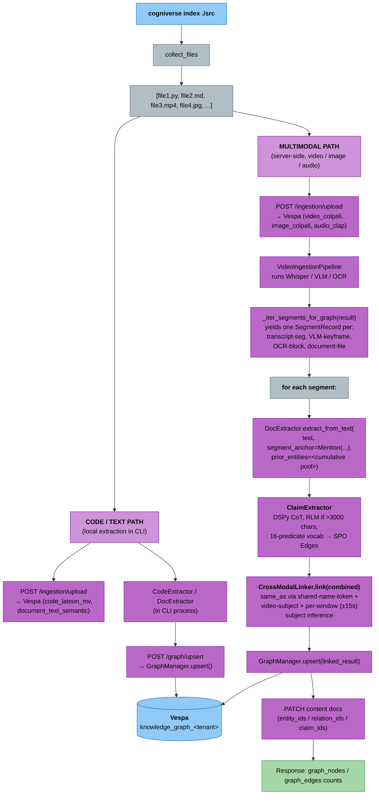

# Knowledge Graph

Cogniverse extracts a knowledge graph from any codebase or document corpus you index. Every run of `cogniverse index` produces two things in parallel:

1. **Content index** — the existing semantic search (vectors in Vespa)
2. **Knowledge graph** — nodes (concepts, functions, entities) and typed edges (`calls`, `imports`, `born_in`, `same_as`, ...) in a separate Vespa schema

Both are tenant-scoped and queryable at runtime. The graph answers questions the content index can't: "what connects X to Y?", "what does SearchAgent call?", "what are the hub concepts in this codebase?"

## Commands

### `cogniverse index` (extended)

Extended with graph extraction. No new flags — the existing `--type` flag controls which files are ingested, and graph extraction happens automatically for supported file types.

```bash
cogniverse index ./src --type code   # tree-sitter extraction → nodes + edges
cogniverse index ./docs --type docs  # GLiNER entity extraction → nodes only
```

> **Note:** The `cogniverse index` CLI command currently only accepts
> `--type code`; `--type docs` and `--type video` are rejected with a
> "not yet implemented" message. The extraction pipeline described below
> (per-extension profile fan-out, GLiNER entities, multimodal graph
> extraction) is fully implemented server-side and reachable directly via
> `POST /ingestion/upload` + `POST /graph/upsert` — it just isn't wired
> up to the `index` CLI command yet for non-code content types.

The `docs` type now fans out per file extension to the right content profile:

| Extension | Content profile | Graph extraction |
|---|---|---|
| `.md` `.txt` `.rst` `.html` `.htm` | `document_text_semantic` | GLiNER entities + `ClaimExtractor` SPO edges |
| `.pdf` | `document_text_semantic` | PDF text → GLiNER entities + `ClaimExtractor` SPO edges |
| `.mp4` `.mov` `.mkv` `.avi` `.webm` | `video_colpali_smol500_mv_frame` | Whisper transcript + VLM captions → GLiNER entities |
| `.jpg` `.jpeg` `.png` `.webp` `.gif` | `image_colpali_mv` | VLM captions + OCR → GLiNER entities |
| `.wav` `.mp3` `.m4a` `.flac` | `audio_clap_semantic` | Whisper transcript → GLiNER entities |

Multimodal graph extraction reuses the text that the content pipelines already produce — Whisper transcripts for audio/video, VLM captions for images and keyframes. No extra model calls. After the content pipeline processes a file, the runtime reads its transcript/description outputs and runs the same DocExtractor that text files use.

Code files (`.py`, `.ts`, `.go`, etc.) go to `code_lateon_mv` for content and tree-sitter for graph extraction.

Output shows both content and graph counts:

```
$ cogniverse index ./libs/runtime --type code
Found 47 code files in ./libs/runtime
Indexing ████████████████████ 47/47

Indexed 47/47 files
  Chunks created: 1283
  Documents fed: 1247
  Graph: 312 nodes, 487 edges
```

### `cogniverse graph stats`

Graph statistics: node count, edge count, and top-degree nodes (the hubs).

```bash
cogniverse graph stats
```

```
Knowledge Graph (tenant: default)
  Nodes: 312
  Edges: 487

Top nodes (by degree):
┌─────────────────────┬────────┐
│ Node                │ Degree │
├─────────────────────┼────────┤
│ searchagent         │     23 │
│ codingagent         │     18 │
│ memoryawaremixin    │     15 │
│ vespabackend        │     12 │
└─────────────────────┴────────┘
```

### `cogniverse graph search`

Semantic search over graph nodes. Uses hybrid BM25 + vector ranking on node name + description.

```bash
cogniverse graph search "video retrieval"
cogniverse graph search "authentication" --top-k 5
```

### `cogniverse graph neighbors`

Direct neighbors of a node (edges out and in).

```bash
cogniverse graph neighbors SearchAgent
cogniverse graph neighbors CodingAgent --depth 2
```

Output groups edges by direction and shows each edge's relation and provenance:

```
Neighbors of SearchAgent
  Outgoing:
    → vespabackend (calls, EXTRACTED)
    → codeextractor (imports, EXTRACTED)
    → search_optimization_module (defines, EXTRACTED)
  Incoming:
    → routingagent (calls, EXTRACTED)
```

### `cogniverse graph path`

Shortest path between two nodes via BFS traversal of outgoing edges.

```bash
cogniverse graph path SearchAgent Vespa
cogniverse graph path CodingAgent OpenShell --max-depth 4
```

## Graph Model

### Node

Every node, regardless of whether it came from code or docs, has the same shape:

| Field | Type | Description |
|---|---|---|
| `name` | string | Display name (e.g. `SearchAgent`) |
| `node_id` | string | Normalized identifier derived from name (e.g. `searchagent`) |
| `description` | string | Short description (from docstring, caption, or context) |
| `kind` | `entity` \| `concept` | Loose label; `entity` for code symbols, `concept` for extracted doc topics |
| `label` | string | GLiNER entity-type tag (`Person`, `Location`, `Organization`, `Substance`, `Concept`, ...). Defaults to `Concept`. Used by `CrossModalLinker` to gate `same_as` linking — a Person-named transcript mention only co-refers with a Concept/Location VLM caption when the caption contains person-indicator words or shares a name token. |
| `mentions` | list\[Mention\] | Per-segment grounded mentions (source_doc_id, segment_id, ts_start, ts_end, modality, evidence_span) |
| `degree` | int | Number of edges touching this node (computed) |
| `embedding` | `tensor<bfloat16>(token{}, v[128])` | ColBERT multi-vector (LateOn 128-dim per token, `colbert_pylate` sidecar) of `name + description` |
| `embedding_binary` | `tensor<int8>(token{}, v[16])` | 1-bit-packed copy of `embedding` for the hamming pre-filter stage |

Search ranks nodes with `hybrid_binary_bm25`: hamming distance on `embedding_binary` narrows candidates, then a full bfloat16 MaxSim rerank on `embedding` combines with BM25 over `name`/`description`.

The `node_id` is deterministic: "SearchAgent" and "searchagent" normalize to the same id, so the same symbol extracted from different files is a single node with merged `mentions`.

### Edge

Every edge has the same shape:

| Field | Type | Description |
|---|---|---|
| `source_node_id` | string | Normalized source node id |
| `target_node_id` | string | Normalized target node id |
| `relation` | string | Free-text label: `calls`, `imports`, `defines` (code, EXTRACTED); `born_in`, `discovered`, `worked_at`, `won`, `contradicts`, `same_as`, ... (claims/cross-modal, INFERRED) |
| `evidence_span` | string | Verbatim text span that grounded this edge |
| `segment_id` | string | Segment (e.g. `frame_0`, `transcript_0`) where the edge was found |
| `ts_start` | float | Segment start timestamp (seconds; 0.0 for non-temporal content) |
| `ts_end` | float | Segment end timestamp |
| `modality` | string | Content modality (`code`, `text`, `video`, `image`, `audio`) |
| `provenance` | string | `EXTRACTED` = found structurally (AST); `INFERRED` = LLM/claim guess; `video_subject_inference` = `CrossModalLinker`'s video-subject/per-window `same_as` edges (a third value, not a strict two-value enum) |
| `source_doc_id` | string | Source file where this edge was found |
| `confidence` | float | 0.0-1.0 confidence score |

The `edge_id` is `sha1(source_node_id | relation | target_node_id | segment_id | ts_start | ts_end)[:16]` — the same (source, relation, target, segment) from two extractors produces the same edge, so upserts are idempotent.

## Extraction

Extractors are an internal detail — every extractor emits the same `Node` / `Edge` shape. The graph manager picks the right extractor per file extension.

### Code extractor (tree-sitter)

Supported languages: Python, JavaScript, TypeScript, Go (via `tree-sitter-python`, `tree-sitter-javascript`, etc., which are already cogniverse runtime deps).

For each file the extractor walks the AST and emits:

| Node type | Source |
|---|---|
| The module itself | File path stem |
| Function/method definitions | `function_definition`, `method_definition`, etc. |
| Class/struct/interface definitions | `class_definition`, `class_declaration`, `interface_declaration`, `struct_item`, `impl_item`, `trait_item` |
| Imported symbols | `import_statement`, `import_from_statement`, `use_declaration` |

| Edge type | Relation | Provenance |
|---|---|---|
| Module → defined symbol | `defines` | EXTRACTED |
| Module → imported symbol | `imports` | EXTRACTED |
| Function → called function | `calls` | EXTRACTED |

All code edges are `EXTRACTED` — these are structural facts, not LLM guesses.

### Doc extractor (GLiNER + regex fallback)

Supported extensions: `.md`, `.txt`, `.rst`, `.html`, `.htm`, `.pdf`.

- **Primary path:** GLiNER (`urchade/gliner_large-v2.1`) predicts entities with labels: Person, Organization, Location, Date, Substance, Award, Field, Event, Concept, Technology, Product, Algorithm, Model, Framework, Language
- **Fallback path:** regex for capitalized multi-word phrases when GLiNER is unavailable (stripping leading articles like "The")
- Text is chunked into paragraph-aware blocks of ~2000 chars before extraction

| Node type | Source |
|---|---|
| Named entities | GLiNER prediction |
| Capitalized concepts | Regex fallback |

Co-occurrence `mentioned_with` edges have been removed from the codebase —
edges are now produced only by `ClaimExtractor` (real SPO relations, see the
extractor below). `DocExtractor` itself is edge-capable only when
constructed with a `claim_extractor`. Two separate call sites use it
differently:

- **CLI local pass** (`_extract_and_upsert_graph` in `cli/index.py`, used for
  `--type code`'s text-like siblings and — once `--type docs` is wired up —
  local text/PDF files) constructs `DocExtractor()` with no `claim_extractor`,
  so this pass produces **nodes only, zero edges**.
- **Automatic server-side pass** (`_extract_graph_per_segment`, triggered on
  every completed `POST /ingestion/upload` whose pipeline output contains
  transcript/description/document-file text — not just video/image/audio but
  also plain `.md`/`.pdf` uploads via `document_text_semantic`) constructs
  `DocExtractor` **with** a `ClaimExtractor`, so it emits real SPO edges. This
  pass runs independently of the CLI's local pass, so a document uploaded via
  `cogniverse index` or directly via `POST /ingestion/upload` ends up with
  real edges in Vespa even though the CLI's own local extraction step
  reports `0` for that file — the CLI's node/edge summary counts only its own
  local pass, not the automatic per-upload one.

### Multimodal extractor (video / image / audio / document)

Unlike the CLI's local code/text extraction pass, this extractor runs
**inside the runtime**, automatically, on every completed `POST
/ingestion/upload` whose content pipeline produces text output — that
includes video/image/audio profiles and also the plain `document_text_semantic`
profile used for `.md`/`.pdf` uploads.

**The flow** (per-segment, with `Mention` provenance + SPO claim edges + cross-modal linking):

1. A file completes ingestion via `POST /ingestion/upload` — e.g. a `.mp4` uploaded with the `video_colpali_smol500_mv_frame` profile (the CLI's `cogniverse index` calls this same endpoint for every file).
2. Runtime's ingestion pipeline processes the file normally — for video, that means Whisper audio transcription, keyframe extraction, a VLM descriptor call per keyframe, embedding generation, and a Vespa feed.
3. After the pipeline returns, `routers/ingestion.py` iterates the result with `_iter_segments_for_graph()`, which yields one `SegmentRecord` per text-emitting source:
   - one per Whisper transcript segment (carries `ts_start`/`ts_end` from the Whisper output)
   - one per VLM keyframe description (`segment_id="frame_<idx>"`, anchored at the frame timestamp)
   - one per OCR/caption block on a keyframe
   - one per document file (PDF / OCR'd page)
4. `_extract_graph_per_segment()` calls `DocExtractor.extract_from_text(text, ..., segment_anchor=mention)` per segment. Each entity GLiNER finds gets a structured `Mention` (source_doc_id + segment_id + ts_start + ts_end + modality + verbatim evidence_span) instead of a bare doc-id string. A cross-segment `entity_pool` is threaded forward so the `ClaimExtractor` resolves pronouns ("She later won the Nobel Prize" → Marie Curie when introduced in an earlier segment).
5. `ClaimExtractor` (DSPy ChainOfThought + `InstrumentedRLM` promotion for inputs > 3000 chars) produces real SPO edges with predicates from a locked 16-element vocabulary (`born_in`, `discovered`, `worked_at`, `won`, `contradicts`, ...). Predicate normalization + a vocabulary filter drop free-form LM emissions ("was_born_in" → `born_in`, "yellow" / "in" / "glass" → dropped).
6. `CrossModalLinker` runs once per `source_doc_id` after all per-segment passes, emitting `same_as` edges via three structural-inference primitives (no pairwise text-similarity scoring): **shared-name-token coreference** (two cross-modal mentions whose Node names share a substantive token, e.g. "Marie Curie" / "Curie 1903" — `provenance="INFERRED"`); **video-subject inference** (when one Person holds ≥60% of a doc's transcript Person-mentions, every generic VLM/OCR caption in that doc links to that subject — `provenance="video_subject_inference"`); and **per-window subject inference** (when no Person dominates the whole video, each VLM/OCR mention falls back to the dominant Person inside a `±window_s` window — default 15s — around its timestamp, same `video_subject_inference` provenance tag). A caption only qualifies for subject attribution if it isn't already a Person node and its tokens contain a person-indicator word (`woman`, `scientist`, `speaker`, ...).
7. The accumulated `ExtractionResult` is `GraphManager.upsert()`'d to the tenant's shared `knowledge_graph_<tenant>` schema, then per-segment back-references (`entity_ids` / `relation_ids` / `claim_ids`) are PATCHed onto each content document so a single Vespa join finds every claim grounded in a given segment.

**No new model calls** — the multimodal path reuses Whisper/VLM outputs that the content pipelines already produce. Whether a file gets graph extraction or not depends on whether its pipeline emits text:

| File kind | Source of text | Graph nodes |
|---|---|---|
| Text doc (`.md`, `.txt`, etc.) | File contents | Yes |
| PDF | `PyPDF2` text extraction | Yes |
| Video | Whisper transcript + VLM keyframe captions + optional OCR | Yes |
| Image | VLM caption + optional OCR | Yes (if pipeline produces captions) |
| Audio | Whisper transcript | Yes |
| Silent video / no-caption image | (nothing) | No graph extraction — just content indexing |

**Ingestion response** now includes graph counts so you can see what was extracted per file:

```bash
$ curl -s -X POST http://localhost:28000/ingestion/upload \
    -F "file=@demo.mp4" -F "profile=video_colpali_smol500_mv_frame" -F "tenant_id=default"
{
  "status": "success",
  "video_id": "demo",
  "chunks_created": 47,
  "documents_fed": 47,
  "graph_nodes": 12,
  "graph_edges": 28,
  "processing_time": 34.2
}
```

Graph extraction is fail-safe: if the extractor errors or the GraphManager factory isn't wired, ingestion still succeeds with `graph_nodes: 0` — content indexing is never blocked by graph extraction.

## REST API

The CLI is a thin client over these endpoints at `/graph/`:

| Endpoint | Method | Purpose |
|---|---|---|
| `/graph/upsert` | POST | Batch upsert nodes + edges for a tenant |
| `/graph/search` | GET | Hybrid BM25 + vector search over nodes |
| `/graph/neighbors` | GET | Out/in edges of a node |
| `/graph/path` | GET | Shortest path between two nodes (BFS, default max depth 4, up to 6) |
| `/graph/stats` | GET | Node/edge counts + top-degree nodes |

**Upsert example:**

```bash
curl -X POST http://localhost:28000/graph/upsert \
  -H "Content-Type: application/json" \
  -d '{
    "tenant_id": "default",
    "source_doc_id": "demo.py",
    "nodes": [
      {"name": "Foo", "description": "A class", "kind": "entity"},
      {"name": "Bar", "description": "Another class", "kind": "entity"}
    ],
    "edges": [
      {
        "source": "Foo", "target": "Bar", "relation": "calls",
        "evidence_span": "Foo().bar()", "segment_id": "demo.py",
        "ts_start": 0.0, "ts_end": 0.0, "modality": "code",
        "provenance": "EXTRACTED"
      }
    ]
  }'
```

Response:
```json
{"status": "upserted", "nodes_upserted": 2, "edges_upserted": 1}
```

## Consumer agents (query time)

The knowledge graph built at ingestion is **complementary** to each agent's
own Mem0 memory — not a competing store. `libs/runtime/cogniverse_runtime/routers/knowledge.py`
exposes nine `/admin/tenants/{tenant_id}/knowledge/...` routes, one per
knowledge-tier agent (the seven Knowledge-Graph & Reasoning agents plus the
two Multi-tenant & federation agents). Six of those nine expose a public
graph method (`KnowledgeGraphTraversalAgent.traverse`,
`TemporalReasoningAgent.compare_over_time`,
`MultiDocumentSynthesisAgent.synthesize`,
`ContradictionReconciliationAgent.detect`,
`KnowledgeSummarizationAgent.summarize`, `CitationTracingAgent.trace`) that
reads the shared, provenance-rich KG and merges the result into a `kg_*`
output field on every request.

At dispatch, the tenant's `GraphManager` is bound onto the agent —
`agent_dispatcher._bind_graph_manager` on the orchestrator-routing path, and
`routers/knowledge.py::_bind_graph` on the `/admin/.../knowledge/...` routes.
With the graph bound, the agent's `_process_impl` walks its own Mem0 memory
**and** consults the shared KG, merging the KG result into dedicated output
fields (named below):

| Agent | Output field | Bridge from request |
|---|---|---|
| `KnowledgeGraphTraversalAgent` | `nodes` / `edges` | `start_subject_key` |
| `TemporalReasoningAgent` | `kg_timeline` | `subject_key` |
| `MultiDocumentSynthesisAgent` | `kg_claim_groups` | (query-agnostic; all claims) |
| `ContradictionReconciliationAgent` | `kg_conflict_entries` | `subject_key` + `predicate` |
| `KnowledgeSummarizationAgent` | `kg_video_summaries` | `subject_keys` |
| `CitationTracingAgent` | `kg_primary_sources` | `claim_id` (KG Edge id) |

The complement is fail-safe: with no graph bound (or the backend unconfigured)
the bind is a no-op, the `kg_*` fields stay empty, and the agent returns its
Mem0-only answer.

The remaining three knowledge-tier routes — `audit/explain`,
`cross_tenant/compare`, `federated/query` — do **not** call `_bind_graph` and
have no `kg_*` output field, but their agents still ship graph-consuming code:

| Agent | Group | Graph method | Wiring status |
|---|---|---|---|
| `AuditExplanationAgent` | Knowledge-Graph & Reasoning | `explain(answer_id)` — renders a Claim/Source/Evidence/Confidence block from a KG Edge via `GraphBindableMixin` | Not called from `_process_impl` or the `audit/explain` route; reachable only by binding a `GraphManager` and invoking it directly |
| `CrossTenantComparisonAgent` | Multi-tenant & federation | `compare(tenant_a, tenant_b)` — diffs two tenants' node_id sets (plus an optional org-trunk manager) into shared/tenant_only/trunk_only | Uses the plural `set_graph_managers(...)`, not the singular `set_graph_manager` the dispatcher auto-binds; no route wires it up |
| `FederatedQueryAgent` | Multi-tenant & federation | `query(text, tenants_or_overlays)` — scans bound `GraphManager`s for nodes whose name contains the query text, deduped by `node_id` | Same `set_graph_managers(...)` gap as above |

See
[Knowledge System Diagrams → 9-Agent Knowledge Dispatch](../diagrams/knowledge-system-diagrams.md#9-agent-knowledge-dispatch)
for the full nine-route breakdown.

## Storage

Each tenant gets its own Vespa schema — `knowledge_graph_<tenant>` — holding both nodes and edges in the same document type, discriminated by a `doc_type` field (`node` or `edge`). The schema is deployed lazily on the first graph upsert or query for a new tenant.

**Namespace:** `graph_content` (Vespa Document v1 API).
**Schema name:** `knowledge_graph_<tenant>` (e.g. `knowledge_graph_acme` for tenant `acme`).
**Queries:** All graph manager operations target the tenant's own schema, so tenants can't see each other's nodes/edges.

## Architecture



**Two extraction paths, one graph.** Code is extracted only locally in the CLI process (AST-based, no server round-trip needed). Video/image/audio/document files are extracted server-side, inside the ingestion pipeline, because that's where Whisper/VLM/OCR/`ClaimExtractor` already run — this is the only path that produces real SPO edges. Text/PDF files that also go through the CLI's local pass pick up a redundant, edge-less node extraction on top. Both paths write to the tenant's `knowledge_graph_<tenant>` schema in the same way, and upserts are idempotent so the redundancy is harmless.

## Comparison with graphify

[graphify](https://github.com/safishamsi/graphify) is a Claude Code skill that builds a knowledge graph from any folder. Cogniverse's knowledge graph covers a lot of what graphify does, and a few things that are still gaps.

**Shared features:**

- Tree-sitter code extraction (functions, classes, calls, imports)
- Entity extraction from text docs
- Unified Node + Edge model with typed provenance
- Semantic search over nodes, path queries, stats
- Incremental / idempotent upserts
- Multi-language code support

**What cogniverse has that graphify doesn't:**

- Multi-tenant isolation via `tenant_id`
- Integration with the rest of the cogniverse stack (memory, agents, runtime API)
- Vespa-backed (clustered, persistent) rather than file-based
- Ties to the existing content index — the same `cogniverse index` call feeds both
- Provenance-grounded LLM-based SPO claim extraction from text/video/audio (`ClaimExtractor`, DSPy ChainOfThought over a locked 16-predicate vocabulary, per-`Mention` timestamp/segment grounding) plus structural cross-modal `same_as` linking (`CrossModalLinker`)

**What graphify has that cogniverse doesn't (yet):**

- **Community detection** (Leiden clustering) for topic grouping — would need `graspologic`
- **LLM-based inference of code relationships** — cogniverse's code edges (`calls`/`imports`/`defines`) are purely AST-structural; it doesn't LLM-infer semantic code relationships like graphify's "X implements Y", "X depends on Z". (Cogniverse does have LLM-based typed edge inference for extracted text/video/audio via `ClaimExtractor` — that gap has closed.)
- **Interactive HTML visualization, Obsidian export, Gephi, Neo4j cypher** — cosmetic output formats
- **MCP server, git post-commit hook, watch mode** — integration conveniences
- **Token reduction benchmark** — measuring query-time token savings

## Troubleshooting

**`Graph stats: 0 nodes, 0 edges`** — the extraction ran but either didn't find any entities or the upsert failed. Check runtime logs: `kubectl logs deployment/cogniverse-runtime -n cogniverse -c runtime | grep -i graph`.


**`tree-sitter parser for X unavailable`** — only Python, JavaScript, TypeScript, and Go parsers are bundled. Other code files are silently skipped by the code extractor but still get content-indexed.

**`GLiNER load failed, falling back to no-op`** — GLiNER download failed or the model cache is corrupt. The doc extractor falls back to a regex-based capitalized phrase extractor, which is weaker but still produces nodes. Fix: ensure the HF cache at `/home/cogniverse/.cache/huggingface` is mounted in the runtime pod, or delete it to force a fresh download.

**Entity extracted with the wrong name (e.g. "The ColPali" instead of "ColPali")** — the regex fallback strips leading articles but isn't perfect. Install GLiNER properly for high-quality extraction.
