# Cogniverse Synthetic Data Generation

**Package**: `cogniverse-synthetic`
**Layer**: Implementation Layer (Yellow/Green)
**Version**: Derived from VCS metadata

Generates schema-validated optimizer training data from tenant-scoped backend
content. Production labeling callbacks supervise entity extraction, query
enhancement, profile selection, and routing; routing query generation also uses
a validated DSPy module. Workflow plans are source-grounded local generation.

---

## Purpose

The `cogniverse-synthetic` package provides:

- **Validated Generation**: Preserves production labeling outputs and validates
  source-grounded workflow plans and DSPy-generated routing queries
- **Backend-Agnostic Sampling**: Works with any backend implementing the `Backend` interface (VespaBackend ships today)
- **Optimizer Support**: Generates data for `query_enhancement`, `entity_extraction`, `profile`, `routing`, `workflow`, `unified`, and `cross_modal`
- **Validated Output**: Pydantic schemas for every optimizer plus routing retry metadata
- **REST API**: FastAPI router for HTTP endpoints

---

## Architecture

### Position in the 13-Package Workspace

```mermaid
flowchart TB
    subgraph FoundationLayer["<span style='color:#000'>Foundation Layer</span>"]
        SDK["<span style='color:#000'>cogniverse-sdk</span>"]
        Foundation["<span style='color:#000'>cogniverse-foundation</span>"]
    end
    subgraph CoreLayer["<span style='color:#000'>Core Layer</span>"]
        Core["<span style='color:#000'>cogniverse-core</span>"]
        Evaluation["<span style='color:#000'>cogniverse-evaluation</span>"]
        Telemetry["<span style='color:#000'>cogniverse-telemetry-phoenix</span>"]
    end
    subgraph ImplementationLayer["<span style='color:#000'>Implementation Layer</span>"]
        Agents["<span style='color:#000'>cogniverse-agents</span>"]
        Vespa["<span style='color:#000'>cogniverse-vespa</span>"]
        Synthetic["<span style='color:#000'><b>cogniverse-synthetic</b></span>"]
    end
    subgraph ApplicationLayer["<span style='color:#000'>Application Layer</span>"]
        Runtime["<span style='color:#000'>cogniverse-runtime</span>"]
        Dashboard["<span style='color:#000'>cogniverse-dashboard</span>"]
        CLI["<span style='color:#000'>cogniverse-cli</span>"]
        Finetuning["<span style='color:#000'>cogniverse-finetuning</span>"]
        Messaging["<span style='color:#000'>cogniverse-messaging</span>"]
    end

    Synthetic --> SDK
    Synthetic --> Foundation
    Synthetic --> Core
    Agents --> Synthetic
    Runtime --> Synthetic
    Finetuning --> Synthetic

    style FoundationLayer fill:#a5d6a7,stroke:#388e3c,color:#000
    style CoreLayer fill:#ce93d8,stroke:#7b1fa2,color:#000
    style ImplementationLayer fill:#ffcc80,stroke:#ef6c00,color:#000
    style ApplicationLayer fill:#90caf9,stroke:#1565c0,color:#000
    style Synthetic fill:#ffb74d,stroke:#ef6c00,color:#000
```



### Dependencies

**Workspace Dependencies:**
- `cogniverse-sdk` (required) - Backend interface
- `cogniverse-foundation` (required) - Configuration classes (`BackendConfig`, `SyntheticGeneratorConfig`, etc.)
- `cogniverse-core` (required) - Approval interfaces and tenant constants

**External Dependencies:**
- `dspy-ai==3.1.3` - DSPy framework for LLM programs
- `pydantic==2.12.5` - Data validation and schemas
- `fastapi==0.135.3` - REST API framework
- `httpx==0.28.1` - HTTP client

---

## Key Features

### 1. Production-Supervised Generation

Routing uses a validated DSPy query module and a production gateway decision.
Entity extraction, query enhancement, and profile selection use their
production agent callbacks; workflow planning remains local and source-grounded.

Every example below passes `agents_config` from the active configuration's
top-level `agents` object. The package never searches the filesystem for it.

```python
from cogniverse_synthetic import SyntheticDataService
from cogniverse_synthetic.schemas import SyntheticDataRequest

service = SyntheticDataService(
    backend=vespa_backend,
    backend_config=backend_config,
    generator_config=generator_config,
    agents_config=agents_config,
)

# Generate data with DSPy-driven query generation
request = SyntheticDataRequest(
    optimizer="routing",
    count=100,
    tenant_id="acme:production",
)

response = await service.generate(request)
print(f"Generated {response.count} examples")
print(f"Backend query strategy: {response.metadata['backend_query_strategy']}")
```

### 2. Backend-Agnostic Sampling

Works through the `Backend` interface; `VespaBackend` is the implementation
available in this workspace:

```python
from cogniverse_vespa import VespaBackend
from cogniverse_synthetic import SyntheticDataService

# Use Vespa backend (backend_config, schema_loader, config_manager are all required)
vespa_backend = VespaBackend(
    backend_config=backend_config,
    schema_loader=schema_loader,
    config_manager=config_manager,
)
service = SyntheticDataService(
    backend=vespa_backend,
    backend_config=backend_config,
    generator_config=generator_config,
    agents_config=agents_config,
)

# Any other backend implementing cogniverse_sdk.interfaces.backend.Backend
# can be substituted the same way — VespaBackend is the implementation
# that ships today.
```

### 3. Optimizer Support

Supports all seven optimizers registered in `OPTIMIZER_REGISTRY`
(`query_enhancement`, `entity_extraction`, `profile`, `routing`, `workflow`,
`unified`, `cross_modal`):

```python
# Profile Optimizer
request = SyntheticDataRequest(
    optimizer="profile",
    count=100,
    tenant_id="acme:production",
)

# Routing Optimizer
request = SyntheticDataRequest(
    optimizer="routing",
    count=75,
    tenant_id="acme:production",
)

# Query-Enhancement Optimizer
request = SyntheticDataRequest(
    optimizer="query_enhancement",
    count=100,
    tenant_id="acme:production",
)

# Entity-Extraction Optimizer
request = SyntheticDataRequest(
    optimizer="entity_extraction",
    count=100,
    tenant_id="acme:production",
)

# Workflow Optimizer
request = SyntheticDataRequest(
    optimizer="workflow",
    count=100,
    tenant_id="acme:production",
)

# Cross-Modal Optimizer
request = SyntheticDataRequest(
    optimizer="cross_modal",
    count=50,
    tenant_id="acme:production",
)
```

Query-enhancement labels come from the production enhancement agent invoked for
the source-grounded query and context. Profile labels likewise come from the
production profile-selection agent. Their optimizer schemas omit runtime
confidence because it is not a training target. Generated routing examples
preserve the exact confidence returned by the production gateway. Search
quality, target-agent success, and processing time remain explicit unobserved
sentinels.

Every generator returns exactly the requested count or raises with its unique
grounded-query capacity. The service then validates the exact optimizer schema,
a canonical non-empty query, and query uniqueness before constructing the
response. It never pads a shortfall by duplicating training rows.

### 4. Schema Validation and Routing Retry Logic

Every optimizer response is validated by its Pydantic schema. Routing adds
entity-token validation and records the number of failed DSPy attempts before
the valid result:

```python
request = SyntheticDataRequest(
    optimizer="routing",
    count=5,
    tenant_id="acme:production",
)
response = await service.generate(request)
assert response.count == 5
assert response.schema_name == "RoutingExperienceSchema"
for example in response.data:
    assert 1 <= len(example["entities"]) <= 3
    assert example["metadata"]["_generation_metadata"]["retry_count"] in {0, 1, 2}
```

---

## Installation

### Development (Editable Mode)

```bash
# From workspace root
uv sync

# Or install individually
uv pip install -e libs/synthetic
```

### Production

```bash
pip install cogniverse-synthetic

# Automatically installs:
# - cogniverse-sdk
# - cogniverse-foundation
# - cogniverse-core
# - dspy-ai
# - pydantic
# - fastapi
# - httpx
```

---

## Usage

### Basic Setup

```python
from cogniverse_synthetic import SyntheticDataService
from cogniverse_synthetic.schemas import SyntheticDataRequest
from cogniverse_vespa import VespaBackend

# Initialize backend (backend_config, schema_loader, config_manager are all required)
backend = VespaBackend(
    backend_config=backend_config,
    schema_loader=schema_loader,
    config_manager=config_manager,
)

# Initialize service
service = SyntheticDataService(
    backend=backend,
    backend_config=backend_config,
    generator_config=generator_config,
    agents_config=agents_config,
)
```

### Generate Training Data

```python
# Generate profile-selection training examples
request = SyntheticDataRequest(
    optimizer="profile",
    count=100,
    vespa_sample_size=200,
    max_profiles=3,
    tenant_id="acme:production",
)

response = await service.generate(request)

print(f"Generated {response.count} examples")
print(f"Sampled content count: {response.metadata['sampled_content_count']}")

# Use examples for training (response.data is a list of dicts)
for example in response.data:
    print(f"Query: {example['query']}")
    print(f"Modality: {example['modality']}")
    print(f"Selected profile: {example['selected_profile']}")
```

### REST API Integration

```python
from fastapi import FastAPI
from cogniverse_synthetic import router

app = FastAPI()
app.include_router(router, tags=["synthetic-data"])  # router already carries prefix="/synthetic"

# Endpoints available:
# POST /synthetic/generate - Generate training data
# GET /synthetic/optimizers - List available optimizers
# GET /synthetic/optimizers/{name} - Get optimizer config
# GET /synthetic/health - Health check
# POST /synthetic/batch/generate - Batch generation
```

### Using the REST API

```bash
# Generate data
curl -X POST http://localhost:8000/synthetic/generate \
  -H "Content-Type: application/json" \
  -d '{
    "optimizer": "profile",
    "count": 100,
    "tenant_id": "acme:production"
  }'

# List optimizers
curl http://localhost:8000/synthetic/optimizers

# Get optimizer config
curl http://localhost:8000/synthetic/optimizers/profile

# Health check
curl http://localhost:8000/synthetic/health

# Batch generation - optimizer/count_per_batch/num_batches/tenant_id are
# query parameters, not a JSON body. One service call generates the complete
# globally unique pool and reports contiguous batch partitions.
curl -X POST "http://localhost:8000/synthetic/batch/generate?optimizer=profile&count_per_batch=100&num_batches=5&tenant_id=acme:production"
```

---

## Package Structure

```text
libs/synthetic/cogniverse_synthetic/
├── __init__.py              # Package exports
├── schemas.py               # Pydantic schemas for all optimizer types
├── registry.py              # Optimizer configuration registry (OPTIMIZER_REGISTRY dict)
├── service.py               # Main orchestrator service
├── api.py                   # FastAPI router
├── profile_selector.py      # LLM/rule-based profile selection
├── backend_querier.py       # Backend-agnostic content sampling
├── dspy_signatures.py       # DSPy signatures (GenerateModalityQuery, GenerateEntityQuery, InferAgentFromModality)
├── dspy_modules.py          # Validated DSPy module (ValidatedEntityQueryGenerator)
├── generators/              # Concrete generator implementations
│   ├── __init__.py
│   ├── base.py              # Base generator interface
│   ├── entity_extraction.py # Entity-extraction generator
│   ├── profile.py           # Profile selection generator
│   ├── query_enhancement.py # Query-enhancement generator
│   ├── routing.py           # Routing strategy generator
│   └── workflow.py          # Workflow generator
├── approval/                # Human-in-the-loop approval workflow
│   ├── __init__.py
│   ├── confidence_extractor.py
│   └── feedback_handler.py
└── utils/                   # Utilities
    ├── __init__.py
    └── agent_inference.py
```

---

## Development

### Running Tests

```bash
# Run all synthetic tests
JAX_PLATFORM_NAME=cpu uv run pytest \
  tests/routing/unit/synthetic/ tests/synthetic/ \
  tests/agents/integration/test_replacement_record_store_real_redis.py \
  tests/runtime/integration/test_backend_querier_real_vespa.py \
  -v --tb=long

# Tests cover:
# - Schemas and validation
# - All registered generator paths
# - Backend querying and optimizer registry lookups
# - Service orchestration
# - Approval workflow
# - Canonical replacement selection in Redis
# - Exact temporal cutoff and newest-first retrieval in Vespa
```

### Code Style

```bash
# Format code
uv run ruff format libs/synthetic

# Lint code
uv run ruff check libs/synthetic

# Type check
uv run mypy libs/synthetic
```

---

## Configuration

Configuration is provided via `BackendConfig` and `SyntheticGeneratorConfig`
from `cogniverse-foundation` (both require `tenant_id`):

```python
import json
from pathlib import Path

from cogniverse_foundation.config.unified_config import (
    BackendConfig,
    BackendProfileConfig,
    SyntheticGeneratorConfig,
)

PROFILE_NAME = "video_colpali_smol500_mv_frame"

backend_config = BackendConfig(
    tenant_id="acme:production",
    backend_type="vespa",
    url="http://localhost",
    port=8080,
    profiles={
        PROFILE_NAME: BackendProfileConfig(
            profile_name=PROFILE_NAME,
            type="video",
            schema_name=PROFILE_NAME,
            embedding_type="multi_vector",
            pipeline_config={"extract_keyframes": True},
        )
    },
)
raw_synthetic = json.loads(Path("configs/config.json").read_text())["synthetic"]
generator_config = SyntheticGeneratorConfig.from_dict(
    {"tenant_id": "acme:production", **raw_synthetic}
)

service = SyntheticDataService(
    backend=backend,
    backend_config=backend_config,
    generator_config=generator_config,
    agents_config=agents_config,
)
```

### Environment Variables

The package does not read LM environment variables directly. Configure DSPy's
LM in the caller before routing generation, or use the runtime optimization CLI,
which resolves the tenant's LM configuration. An `llm_client` passed to
`SyntheticDataService` controls only the preliminary choice of backend profiles
to sample. Profile training labels come from the configured production
`profile_labeler` callback.

---

## DSPy Signatures and Modules

### Query Generation Signatures

Three signatures are defined in `dspy_signatures.py`:

- `GenerateModalityQuery` — generates a natural search query for a given content modality
- `GenerateEntityQuery` — generates a query that must contain every provided entity as a complete span
- `InferAgentFromModality` — infers the correct agent for a modality/query pair

```python
from cogniverse_synthetic.dspy_signatures import GenerateModalityQuery, GenerateEntityQuery
import dspy

class ModalityQueryGenerator(dspy.Module):
    def __init__(self):
        self.generate = dspy.ChainOfThought(GenerateModalityQuery)

    def forward(self, modality, topics, context):
        result = self.generate(
            modality=modality,
            topics=topics,
            context=context
        )
        return result.query
```

### Validation and Retry

```python
from cogniverse_synthetic.dspy_modules import ValidatedEntityQueryGenerator

generator = ValidatedEntityQueryGenerator(max_retries=3)

# Automatically retries up to 3 times until every entity appears in the query
result = generator.forward(
    topics="machine learning, neural networks",
    entities=["PyTorch", "TensorFlow"],
    entity_types=["TECHNOLOGY", "TECHNOLOGY"],
)
print(result.query)
```

---

## Optimizer Registry

The package includes a registry of optimizer configurations. There is no
`OptimizerRegistry` class — the registry is a module-level dict
`OPTIMIZER_REGISTRY` mapping optimizer names to `OptimizerConfig` objects,
with helper functions for lookup and listing.

```python
from cogniverse_synthetic.registry import (
    OPTIMIZER_REGISTRY,
    OptimizerConfig,
    get_optimizer_config,
    list_optimizers,
)

# Get optimizer config by name
config = get_optimizer_config("routing")
print(config.name)         # "routing"
print(config.description)  # "Advanced routing with entity extraction..."

# List all registered optimizers
for name, description in list_optimizers().items():
    print(f"{name}: {description}")

# Direct registry access
print(list(OPTIMIZER_REGISTRY.keys()))
# ['query_enhancement', 'entity_extraction', 'routing', 'workflow',
#  'profile', 'unified', 'cross_modal']
```

---

## Backend Abstraction

The package works with any backend that implements the Backend interface:

```python
from cogniverse_synthetic.backend_querier import BackendQuerier
from cogniverse_foundation.config.unified_config import (
    BackendConfig,
    BackendProfileConfig,
    FieldMappingConfig,
)

TENANT_ID = "acme:production"
PROFILE_NAME = "video_colpali_smol500_mv_frame"
backend_config = BackendConfig(
    tenant_id=TENANT_ID,
    profiles={
        PROFILE_NAME: BackendProfileConfig(
            profile_name=PROFILE_NAME,
            type="video",
            schema_name=PROFILE_NAME,
            embedding_type="multi_vector",
            pipeline_config={"extract_keyframes": True},
        )
    },
)

querier = BackendQuerier(
    backend=your_backend,
    backend_config=backend_config,
    field_mappings=FieldMappingConfig(),
)

# Sample documents from any backend
documents = await querier.query_profiles(
    profile_configs=[
        {
            "profile_name": PROFILE_NAME,
            **backend_config.profiles[PROFILE_NAME].to_dict(),
        }
    ],
    sample_size=10,
    strategy="diverse",
    tenant_id=TENANT_ID,
)

# Works with any backend implementing cogniverse_sdk.interfaces.backend.Backend.
# VespaBackend is the implementation that ships today; other backends can be
# added the same way.
```

---

## Documentation

- **Full Docs**: [Synthetic Data Generation](../../docs/synthetic-data-generation.md)
- **Architecture**: [SDK Architecture](../../docs/architecture/sdk-architecture.md)
- **Diagrams**: [SDK Architecture Diagrams](../../docs/diagrams/sdk-architecture-diagrams.md)
- **DSPy Docs**: [DSPy Documentation](https://dspy-docs.vercel.app/)

---

## Troubleshooting

### Common Issues

**1. Routing Raises After 3 Invalid Results**
- Verify the caller configured DSPy's LM before routing generation
- Review the sampled entities and DSPy signature inputs
- Invalid LM output is never converted into fabricated training data

**2. Backend Connection Issues**
```python
# Test backend connection
backend = VespaBackend(
    backend_config=backend_config,
    schema_loader=schema_loader,
    config_manager=config_manager,
)
backend.health_check()
```

**3. No Documents Sampled**
- Verify the configured base schema exists:
  `backend.schema_exists(base_schema_name, tenant_id=...)`
- Check tenant isolation: `backend.get_tenant_schema_name(tenant_id, base_schema_name)`
  should resolve the concrete tenant schema
- Ensure documents exist in schema

---

## Performance

Generation speed depends on backend latency, requested sample size, optimizer,
and the configured agents and LMs. Entity extraction, query enhancement,
profile selection, and routing execute their production labeling boundaries;
routing also invokes its configured DSPy query-generation LM. Workflow plans
are source-grounded local generation.

**Optimization Tips:**
- Use batch generation for large datasets
- Choose a lower-latency configured LM for exploratory runs
- Parallel generation across multiple workers

---

## Contributing

```bash
# Create feature branch
git checkout -b feature/synthetic-improvement

# Make changes
# ...

# Run tests
uv run pytest tests/routing/unit/synthetic/ -v

# Submit PR
```

---

## License

MIT License - See [LICENSE](../../LICENSE) for details.

---

## Related Packages

- **cogniverse-core**: Provides tenant utilities (`SYSTEM_TENANT_ID`) used by this package
- **cogniverse-agents**: Depends on this package to generate training data
- **cogniverse-vespa**: Backend implementation used for sampling documents
- **cogniverse-runtime**: Mounts the synthetic API router
