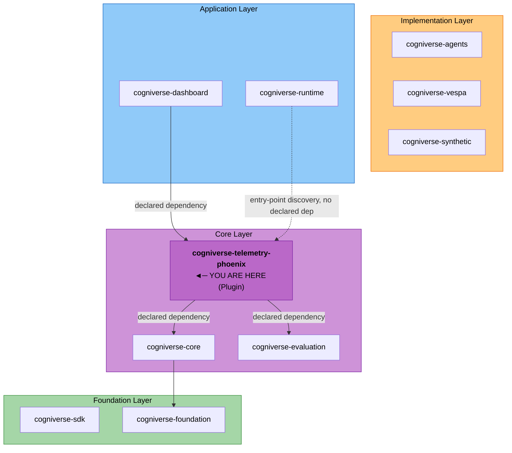

# Cogniverse Telemetry Phoenix

**Package**: `cogniverse-telemetry-phoenix`
**Layer**: Core Layer - Plugin (Pink)
**Version**: 0.1.0

Phoenix telemetry provider plugin for Cogniverse, providing Phoenix-specific implementations of telemetry interfaces for querying spans, managing annotations, datasets, and experiments.

---

## Purpose

The `cogniverse-telemetry-phoenix` package provides:
- **Phoenix Provider**: Plugin implementation for Phoenix telemetry backend
- **Span Querying**: Retrieve and filter OpenTelemetry spans from Phoenix
- **Annotations**: Add human feedback and labels to spans
- **Dataset Management**: Create and manage evaluation datasets
- **Experiment Tracking**: Track DSPy optimization experiments
- **Entry Point Discovery**: Auto-discovered via Python entry points

---

## Architecture

### Position in the Package Structure



### Plugin Architecture

This package implements the **Provider Plugin Pattern**:

```python
# Auto-discovered via entry points
[project.entry-points."cogniverse.telemetry.providers"]
phoenix = "cogniverse_telemetry_phoenix:PhoenixProvider"
```

The foundation layer automatically discovers and loads the Phoenix provider without explicit imports.

### Dependencies

**Workspace Dependencies** (declared in `pyproject.toml`):
- `cogniverse-core` (required) - `CircuitBreaker`, tenant utilities; pulls in `cogniverse-foundation` transitively (base telemetry interfaces)
- `cogniverse-evaluation` (required) - `EvaluationProvider`/`TraceMetrics` interfaces that `PhoenixEvaluationProvider`/`PhoenixAnalytics` implement

**External Dependencies:**
- `arize-phoenix==14.2.1` - Phoenix client + OpenTelemetry SDK (`phoenix.client`, `phoenix.otel`)
- `pandas==2.3.3` - DataFrame operations for spans/annotations/datasets
- `httpx` - Async HTTP client used internally by `AsyncClient`'s transport (pulled in transitively by `arize-phoenix`, not declared directly)

---

## Key Features

### 1. Auto-Discovery via Entry Points

The provider is automatically discovered and loaded:

```python
from cogniverse_foundation.telemetry import TelemetryManager

# Phoenix provider automatically loaded
telemetry = TelemetryManager()
provider = telemetry.get_provider(tenant_id="acme_corp")

# Provider is PhoenixProvider instance
assert provider.name == "phoenix"
```

### 2. Span Querying

Query spans from Phoenix with filtering:

```python
from datetime import datetime, timedelta, timezone
from cogniverse_foundation.telemetry import TelemetryManager

telemetry = TelemetryManager()
provider = telemetry.get_provider(tenant_id="acme_corp")

# Query spans (start_time/end_time are datetime objects; filters is a dict —
# {"name": <span name or list of names>} is pushed down to a server-side
# SpanQuery predicate instead of pulling the whole project window)
spans_df = await provider.traces.get_spans(
    project="cogniverse-acme_corp-search",
    limit=1000,
    start_time=datetime.now(timezone.utc) - timedelta(days=7),
    end_time=datetime.now(timezone.utc),
    filters={"name": "search_service.search"}
)

print(f"Retrieved {len(spans_df)} spans")
```

### 3. Annotations

Add human feedback to spans:

```python
# Add annotation
await provider.annotations.add_annotation(
    span_id="abc123",
    name="human_approval",
    label="approved",
    score=1.0,
    metadata={"reviewer": "alice", "comments": "Looks good"},
    project="cogniverse-acme_corp-search"
)

# Get annotations for a set of spans (takes the spans DataFrame from
# get_spans(), not a single span_id)
annotations = await provider.annotations.get_annotations(
    spans_df=spans_df,
    project="cogniverse-acme_corp-search"
)
```

### 4. Dataset Management

Create and manage evaluation datasets:

```python
import pandas as pd

# Create dataset — name is the identifier; metadata carries Phoenix's
# input_keys/output_keys/description
dataset_id = await provider.datasets.create_dataset(
    name="video_search_queries",
    data=pd.DataFrame([
        {"query": "machine learning tutorial", "expected_modality": "video"},
        {"query": "python programming", "expected_modality": "video"}
    ]),
    metadata={
        "description": "Evaluation queries for video search",
        "input_keys": ["query"],
        "output_keys": ["expected_modality"],
    }
)

# Get dataset by name (returns the full DataFrame; no separate id/project args)
dataset_df = await provider.datasets.get_dataset(name="video_search_queries")
```

### 5. Experiment Tracking

Experiment tracking is **not** part of the telemetry provider's store surface
(`.traces` / `.annotations` / `.datasets`). Phoenix experiments are handled by
the separate evaluation provider (`PhoenixEvaluationProvider`, also shipped in
this package); the DSPy optimizer's `ArtifactManager` persists per-run
experiment metrics as Phoenix datasets through `provider.datasets`.

---

## Installation

### Development (Editable Mode)

```bash
# From workspace root
uv sync

# Or install individually
uv pip install -e libs/telemetry-phoenix
```

### Production

```bash
pip install cogniverse-telemetry-phoenix

# Automatically installs:
# - cogniverse-foundation
# - cogniverse-evaluation
# - arize-phoenix-otel
# - httpx, pandas, polars
```

---

## Configuration

Configuration via `TelemetryConfig` from `cogniverse-foundation`:

```python
from cogniverse_foundation.telemetry import TelemetryManager, TelemetryConfig

config = TelemetryConfig(
    provider="phoenix",  # Optional - auto-detects if omitted
    provider_config={
        "http_endpoint": "http://localhost:6006",  # Phoenix HTTP API
        "grpc_endpoint": "http://localhost:4317",  # Phoenix gRPC OTLP (optional)
    }
)

telemetry = TelemetryManager(config=config)
provider = telemetry.get_provider(tenant_id="acme_corp")
```

### Environment Variables

`cogniverse_telemetry_phoenix` itself reads no environment variables —
`PhoenixProvider.initialize()` takes `http_endpoint`/`grpc_endpoint` from the
`provider_config` dict shown above (or from `TelemetryManager.get_provider()`'s
endpoint derivation off `TelemetryConfig.otlp_endpoint`). The runtime CLIs
(`optimization_cli.py`, `quality_monitor_cli.py`) and the admin router read
these two as a convenience for pointing tooling at a Phoenix instance:

```bash
export PHOENIX_HTTP_ENDPOINT="http://localhost:6006"
export PHOENIX_GRPC_ENDPOINT="localhost:4317"
```

There is no `PHOENIX_API_KEY` support anywhere in this codebase today.

---

## Usage

### Basic Setup

```python
from cogniverse_foundation.telemetry import TelemetryManager

# Initialize telemetry manager
telemetry = TelemetryManager()

# Get Phoenix provider (auto-discovered)
provider = telemetry.get_provider(tenant_id="acme_corp")

# Provider is automatically configured for tenant
assert provider.name == "phoenix"
```

### Query Spans

```python
# Get recent spans
spans_df = await provider.traces.get_spans(
    project="cogniverse-acme_corp-search",
    limit=100
)

# Filter spans
video_search_spans = spans_df[
    spans_df["name"] == "video_search"
]

# Get span details by id
span = await provider.traces.get_span_by_id(
    span_id="abc123",
    project="cogniverse-acme_corp-search"
)
```

### Add Annotations

```python
# Add thumbs up annotation (metadata is required — pass {} if there's none)
await provider.annotations.add_annotation(
    span_id="abc123",
    name="thumbs_up",
    label="positive",
    score=1.0,
    metadata={},
    project="cogniverse-acme_corp-search"
)

# Add detailed feedback
await provider.annotations.add_annotation(
    span_id="abc123",
    name="detailed_feedback",
    label="needs_improvement",
    score=0.5,
    metadata={
        "issue": "results_not_relevant",
        "suggestion": "improve_query_understanding"
    },
    project="cogniverse-acme_corp-search"
)
```

### Create Dataset

```python
import pandas as pd

# create_dataset/get_dataset/append_to_dataset are the only DatasetStore
# operations — build the DataFrame yourself from spans or a file first
queries_df = pd.read_csv("/data/queries.csv")
dataset_id = await provider.datasets.create_dataset(
    name="evaluation_queries",
    data=queries_df,
    metadata={"description": "Queries loaded from /data/queries.csv"}
)

# Append more records to the same dataset as a new version
await provider.datasets.append_to_dataset(
    name="evaluation_queries",
    data=pd.DataFrame([{"query": "new query", "expected_modality": "video"}])
)
```

### Track Experiment

Experiment runs are recorded by the DSPy `ArtifactManager` as Phoenix datasets
(`provider.datasets`), or through the separate `PhoenixEvaluationProvider` — not
through the telemetry provider, which no longer exposes an experiment store.

---

## Multi-Tenant Project Mapping

The provider automatically maps tenants to Phoenix projects:

| Tenant ID | Phoenix Project | Purpose |
|-----------|----------------|---------|
| `acme_corp` | `cogniverse-acme_corp` | Tenant-only project (no service given) |
| `acme_corp` | `cogniverse-acme_corp-search` | Search traces |
| `acme_corp` | `cogniverse-acme_corp-ingestion` | Ingestion traces |
| `acme_corp` | `cogniverse-acme_corp-synthetic_data` | Synthetic data gen |
| `globex_inc` | `cogniverse-globex_inc` | Tenant-only project |
| `default` | `cogniverse-default` | Tenant-only project |

**Project Naming Convention:**
```
cogniverse-{tenant_id}-{service}
```

---

## Development

### Running Tests

```bash
# Run all telemetry tests (unit + integration, covers this package's providers)
uv run pytest tests/telemetry/ -v

# Run integration tests (requires Phoenix)
uv run pytest tests/telemetry/integration/ -v

# Run a specific unit test module
uv run pytest tests/telemetry/unit/test_session_tracking.py -v
```

### Local Phoenix Instance

```bash
# Start Phoenix using Docker
docker run --detach --name phoenix \
  --publish 6006:6006 --publish 4317:4317 \
  arizephoenix/phoenix:latest

# Wait for Phoenix to be ready
curl -s http://localhost:6006/health

# Access Phoenix UI
open http://localhost:6006
```

### Code Style

```bash
# Format code
uv run ruff format libs/telemetry-phoenix

# Lint code
uv run ruff check libs/telemetry-phoenix

# Type check
uv run mypy libs/telemetry-phoenix
```

---

## Plugin Implementation

### Provider Interface

The package implements the `TelemetryProvider` interface, which exposes
exactly three store properties — `.traces`, `.annotations`, `.datasets`.
There is no `.experiments` property; Phoenix experiment tracking lives on
the separate `PhoenixEvaluationProvider` (see
[Experiment Tracking](#5-experiment-tracking) above).

```python
from cogniverse_foundation.telemetry.providers.base import (
    AnnotationStore,
    DatasetStore,
    TelemetryProvider,
    TraceStore,
)

class PhoenixProvider(TelemetryProvider):
    """Phoenix telemetry provider implementation."""

    def __init__(self):
        super().__init__(name="phoenix")  # self.name == "phoenix"
        self._trace_store: TraceStore | None = None
        self._annotation_store: AnnotationStore | None = None
        self._dataset_store: DatasetStore | None = None

    @property
    def traces(self) -> TraceStore:
        return self._trace_store

    @property
    def annotations(self) -> AnnotationStore:
        return self._annotation_store

    @property
    def datasets(self) -> DatasetStore:
        return self._dataset_store
```

### Entry Point Registration

In `pyproject.toml`:

```toml
[project.entry-points."cogniverse.telemetry.providers"]
phoenix = "cogniverse_telemetry_phoenix:PhoenixProvider"
```

This enables automatic discovery by the foundation layer.

---

## API Reference

The three store ABCs live in
`cogniverse_foundation.telemetry.providers.base`; the signatures below are
the actual abstract methods `PhoenixTraceStore` / `PhoenixAnnotationStore` /
`PhoenixDatasetStore` implement.

### TraceStore

```python
# Get spans
spans_df: pd.DataFrame = await provider.traces.get_spans(
    project: str,
    start_time: Optional[datetime] = None,
    end_time: Optional[datetime] = None,
    filters: Optional[Dict[str, Any]] = None,  # e.g. {"name": "search_service.search"}
    limit: int = 1000,
)

# Get single span by id
span: Optional[Dict[str, Any]] = await provider.traces.get_span_by_id(
    span_id: str,
    project: str,
)
```

### AnnotationStore

```python
# Add annotation
annotation_id: str = await provider.annotations.add_annotation(
    span_id: str,
    name: str,
    label: str,
    score: float,
    metadata: Dict[str, Any],
    project: str,
)

# Get annotations for a set of spans (spans_df comes from traces.get_spans())
annotations_df: pd.DataFrame = await provider.annotations.get_annotations(
    spans_df: pd.DataFrame,
    project: str,
    annotation_names: Optional[List[str]] = None,
)

# Bulk-upload evaluation results as annotations
await provider.annotations.log_evaluations(
    eval_name: str,
    evaluations_df: pd.DataFrame,  # columns: span_id, score, label
    project: str,
)
```

### DatasetStore

```python
# Create dataset — name is the identifier
dataset_id: str = await provider.datasets.create_dataset(
    name: str,
    data: pd.DataFrame,
    metadata: Optional[Dict[str, Any]] = None,  # description/input_keys/output_keys/metadata_keys
)

# Load dataset by name
dataset_df: pd.DataFrame = await provider.datasets.get_dataset(name: str)

# Append records to an existing dataset as a new version
await provider.datasets.append_to_dataset(
    name: str,
    data: pd.DataFrame,
    metadata: Optional[Dict[str, Any]] = None,
)
```

---

## Documentation

- **Architecture**: [Architecture Overview](../../docs/architecture/overview.md)
- **Telemetry Guide**: [Telemetry Module](../../docs/modules/telemetry.md)
- **Phoenix Docs**: [Arize Phoenix Documentation](https://docs.arize.com/phoenix/)
- **Diagrams**: [SDK Architecture Diagrams](../../docs/diagrams/sdk-architecture-diagrams.md)

---

## Troubleshooting

### Common Issues

**1. Provider Not Found**
```python
# Ensure package is installed
pip list | grep cogniverse-telemetry-phoenix

# Check entry points
python -c "from importlib.metadata import entry_points; print([ep for ep in entry_points()['cogniverse.telemetry.providers']])"
```

**2. Phoenix Connection Failed**
```bash
# Test Phoenix connectivity
curl http://localhost:6006/health

# Check Phoenix logs
docker logs phoenix
```

**3. Project Not Found**
```python
# List available projects
import httpx
response = httpx.get("http://localhost:6006/v1/projects")
print(response.json())
```

**4. Spans Not Appearing**
- Verify spans are being sent: Check OTLP endpoint (4317)
- Verify project name matches convention
- Check Phoenix UI for spans

---

## Performance

### Batch Operations

```python
# Batch span queries
spans = await provider.traces.get_spans(
    project=project,
    limit=10000  # Fetch large batches
)

# Bulk-upload evaluation results as annotations in one call (the only batch
# annotation path — AnnotationStore has no add_annotations_batch method;
# add_annotation() is per-span)
evaluations_df = pd.DataFrame([
    {"span_id": span_id, "score": 1.0, "label": "approved"}
    for span_id in span_ids
])
await provider.annotations.log_evaluations(
    eval_name="human_approval",
    evaluations_df=evaluations_df,
    project=project,
)
```

### Caching

```python
# functools.lru_cache does not work on coroutine functions — it caches the
# unawaited coroutine object, not the resolved DataFrame. A plain dict keyed
# on the call args is the simplest correct cache for an async function.
_span_cache: dict[tuple[str, int], pd.DataFrame] = {}

async def get_cached_spans(project: str, limit: int) -> pd.DataFrame:
    key = (project, limit)
    if key not in _span_cache:
        _span_cache[key] = await provider.traces.get_spans(project=project, limit=limit)
    return _span_cache[key]
```

---

## Contributing

```bash
# Create feature branch
git checkout -b feature/phoenix-improvement

# Make changes
# ...

# Run tests
uv run pytest tests/telemetry/ -v

# Submit PR
```

---

## License

MIT License - See [LICENSE](../../LICENSE) for details.

---

## Related Packages

- **cogniverse-foundation**: Defines `TelemetryProvider`/`TraceStore`/`AnnotationStore`/`DatasetStore` that this package implements (a transitive dependency of this package via `cogniverse-core`, not the reverse)
- **cogniverse-evaluation**: Defines `EvaluationProvider`/`TraceMetrics` that `PhoenixEvaluationProvider`/`PhoenixAnalytics` implement (a direct dependency of this package)
- **cogniverse-dashboard**: Declares a direct `pyproject.toml` dependency on this package for the Profile Routing Metrics tab and Phoenix analytics
- **cogniverse-core**, **cogniverse-agents**, **cogniverse-runtime**: Consume the auto-discovered Phoenix provider at runtime via the `cogniverse.telemetry.providers` entry point — none declares a direct `pyproject.toml` dependency on this package; the workspace root installs it alongside them
