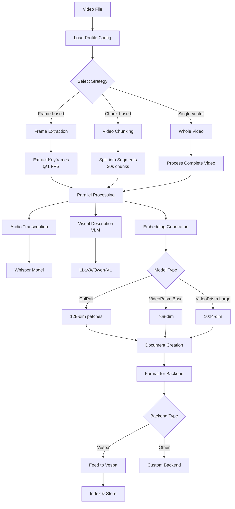

# Video Ingestion Pipeline

The video ingestion pipeline is a flexible, strategy-driven architecture that supports multiple video processing models and backends through a unified interface.

## Overview

The system processes videos through configurable pipelines that can:
- Extract frames or video chunks
- Generate embeddings using various models (ColPali, VideoPrism, ColQwen)
- Transcribe audio tracks
- Store results in search backends like Vespa

## Architecture

### Core Components

1. **Pipeline Core** (`pipeline.py`)
   - VideoIngestionPipeline: Main orchestrator with async processing
   - Concurrent video processing with configurable limits

2. **Strategy Pattern** (`processing_strategy_set.py`, `strategies.py`)
   - ProcessingStrategySet: Orchestrates multiple strategies in sequence
   - Pluggable processing strategies for different content types

3. **Processor Manager** (`processor_manager.py`)
   - Auto-discovery of processors
   - Requirement-based processor provision

4. **Document System** (`src/common/document.py`)
   - Universal document structure for all content types
   - Backend-agnostic format conversion

## Processing Flow

```
Video File
    ↓
1. Strategy Selection (based on profile)
    ↓
2. Segmentation Strategy
    ├── Frame-based: Extract keyframes
    ├── Chunk-based: Extract video segments
    └── Single-vector: Process entire video
    ↓
3. Transcription Strategy (parallel)
    └── Extract audio transcript
    ↓
4. Description Strategy (parallel)
    └── Generate visual descriptions
    ↓
5. Embedding Strategy
    ├── Multi-vector: One embedding per frame/chunk
    └── Single-vector: One embedding per video
    ↓
6. Document Creation
    └── Generic Document with metadata
    ↓
7. Backend Storage
    └── Feed to Vespa/other backends
```

### Detailed Pipeline Flow



## Configuration Profiles

Available profiles in `configs/config.json` under `video_processing_profiles`:

- `video_colpali_smol500_mv_frame` - ColPali model, frame-based multi-vector (128-dim)
- `video_colqwen_omni_mv_chunk_30s` - ColQwen model, 30-second chunks (128-dim)
- `video_videoprism_base_mv_chunk_30s` - VideoPrism base, 30-second chunks (768-dim)
- `video_videoprism_large_mv_chunk_30s` - VideoPrism large, 30-second chunks (1024-dim)
- `video_videoprism_lvt_base_sv_chunk_6s` - VideoPrism LVT base, single-vector 6s chunks
- `video_videoprism_lvt_large_sv_chunk_6s` - VideoPrism LVT large, single-vector 6s chunks

### Profile Configuration Example

```json
"video_colpali_smol500_mv_frame": {
  "schema_name": "video_colpali_smol500_mv_frame",
  "embedding_model": "vidore/colsmol-500m",
  "strategies": {
    "segmentation": {
      "class": "FrameSegmentationStrategy",
      "params": {"fps": 1.0, "max_frames": 3000}
    },
    "embedding": {
      "class": "MultiVectorEmbeddingStrategy",
      "params": {}
    }
  }
}
```

## Embedding Generation

### Supported Models

- **ColPali**: Vision-language model for multimodal understanding
- **ColQwen**: Alternative vision-language model
- **VideoPrism**: Google's video understanding model (base, large, LVT variants)

### Remote Inference Support

Configure remote inference in your config:

```json
{
  "remote_inference_url": "https://your-endpoint.com",
  "remote_inference_api_key": "your-api-key",
  "remote_inference_provider": "infinity"
}
```

Supported providers:
- Infinity: High-performance embedding server
- Modal: Serverless inference platform
- Custom: Generic HTTP API endpoints

## Video Chunking Strategies

### TwelveLabs-Style Implementation

Store entire videos as single documents with multiple chunk embeddings:

- One document per video with multiple 6-second chunk embeddings
- Hybrid search combining BM25 text with chunk-level semantic search
- Efficient storage - all chunks in a single tensor field
- Better context through overlapping chunks

### Schema Design

```json
{
  "video_id": "string",
  "title": "string (BM25 indexed)",
  "transcript": "string (full video transcript)",
  "chunk_embeddings": "tensor<float>(chunk{},x[768])",  // or 1024 for large, 128 for ColPali
  "chunk_metadata": "tensor<float>(chunk{},meta[4])",
  "chunk_transcripts": "array<string>"
}
```

## Usage

### Basic Ingestion

```bash
# Single profile
uv run python scripts/run_ingestion.py \
    --video_dir data/videos \
    --backend vespa \
    --profile video_colpali_smol500_mv_frame

# Multiple profiles
uv run python scripts/run_ingestion.py \
    --video_dir data/videos \
    --backend vespa \
    --profile video_colpali_smol500_mv_frame \
             video_colqwen_omni_mv_chunk_30s
```

### Testing

```bash
# Test with single video
uv run python scripts/run_ingestion.py --max-frames 1

# Monitor logs
tail -f outputs/logs/*.log
```

## Extending the Pipeline

### Adding a New Processor

1. Create processor in `processors/` directory
2. Inherit from `BaseProcessor`
3. Implement `process()` method
4. Auto-discovery will include it

### Adding a New Strategy

1. Create strategy in `strategies.py`
2. Inherit from `BaseStrategy`
3. Implement required methods
4. Add to profile configuration

## Performance Considerations

- Concurrent processing of 2+ videos
- Async I/O for non-blocking operations
- Model caching for efficiency
- Configurable batch sizes for backend feeding

## Common Issues

**Dimension Mismatch**: Check embedding dimensions match schema (768/1024/1152)
**Connection Errors**: Reduce batch size or check backend status
**Format Errors**: Ensure hex strings for binary, floats for dense embeddings