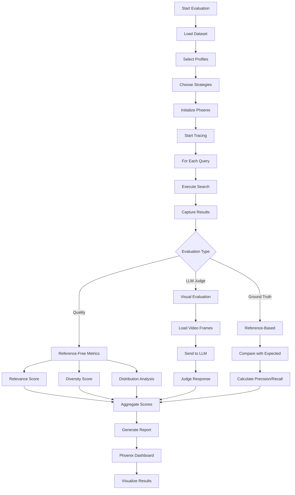

# Evaluation Framework

Comprehensive evaluation capabilities for the video RAG system using Inspect AI, Arize Phoenix, and custom evaluators.

## Overview

The evaluation framework provides:
- **Inspect AI**: Task-based evaluation with custom solvers and scorers
- **Arize Phoenix**: Real-time tracing, observability, and experiment tracking
- **Quality Metrics**: Reference-free relevance, diversity, temporal coverage
- **LLM Judges**: Visual and text evaluation with configurable providers
- **Schema-Driven**: Generic evaluation that works beyond video

## Evaluation Framework Flow



## Quick Start

### Installation

```bash
# Install dependencies
uv pip install inspect-ai arize-phoenix phoenix-evals

# With visual evaluation
uv pip install -e ".[visual]"
```

### Start Phoenix Server

```bash
# Option 1: Local server
python scripts/start_phoenix.py

# Option 2: Docker (if docker-compose.yml exists)
docker run -p 6006:6006 arizephoenix/phoenix:latest

# Phoenix available at http://localhost:6006
```

### Run Evaluation

```bash
# Basic quality evaluation
uv run python src/evaluation/core/experiment_tracker.py \
  --dataset-name golden_eval_v1 \
  --profiles video_colpali_smol500_mv_frame \
  --quality-evaluators

# With LLM visual evaluation
uv run python src/evaluation/core/experiment_tracker.py \
  --dataset-name test_visual \
  --profiles video_videoprism_base_mv_chunk_30s \
  --llm-evaluators \
  --evaluator visual_judge \
  --llm-model ollama/llava:7b
```

## Core Components

### Architecture

- **Task Orchestrator** (`core/task.py`): Main evaluation coordinator
- **Experiment Tracker** (`core/experiment_tracker.py`): High-level runner
- **Solvers** (`core/inspect_solvers.py`): Data acquisition
- **Scorers** (`core/scorers.py`): Metric calculation
- **Evaluators** (`evaluators/`): Quality and LLM-based evaluation
- **Plugins** (`plugins/`): Domain-specific extensions

### Metrics

#### Quality Metrics (Reference-Free)
- **Relevance**: Semantic similarity (0-1)
- **Diversity**: Result variety (0-1)
- **Distribution**: Score consistency
- **Temporal Coverage**: Video timeline coverage

#### LLM Evaluators
- **Visual Judge**: Multimodal frame analysis
- **Reference-Free**: Query-result relevance
- **Reference-Based**: Ground truth comparison
- **Hybrid**: Combined approach

#### Retrieval Metrics
- MRR, NDCG, Precision@k, Recall@k, MAP
- Temporal IoU for moment retrieval

## Creating Datasets

### From Production Traces
```bash
uv run python scripts/bootstrap_dataset_from_traces.py \
  --hours 48 \
  --min-score 0.8 \
  --dataset-name production_v1
```

### From Videos
```bash
uv run python scripts/generate_dataset_from_videos.py \
  --video-dir data/videos \
  --num-queries 100 \
  --dataset-name synthetic_v1
```

### CSV Format
```csv
query,expected_videos,category
"person wearing red",video1|video2,visual
"after the meeting",video3,temporal
```

## Configuration

### Evaluation Config
```json
{
  "use_custom": true,
  "custom_metrics": ["diversity", "temporal_coherence"],
  "top_k": 10,
  "evaluators": {
    "visual_judge": {
      "provider": "ollama",
      "model": "llava:7b",
      "base_url": "http://localhost:11434",
      "frames_per_video": 30,
      "max_videos": 2
    }
  }
}
```

### LLM Setup
```bash
# Install Ollama
curl -fsSL https://ollama.ai/install.sh | sh

# Pull models
ollama pull deepseek-r1:7b  # Text
ollama pull llava:7b        # Visual

# Start service
ollama serve
```

## Phoenix Integration

### Features
- **Traces**: All evaluation traces with timing
- **Datasets**: Managed datasets with versions
- **Experiments**: Result comparisons
- **Evaluations**: Scores attached to traces

### Dashboard
```bash
# Start Streamlit dashboard
streamlit run scripts/phoenix_dashboard_standalone.py
# Access at http://localhost:8501
```

### Analytics
```bash
# Analyze last 24 hours
python scripts/analyze_traces.py analyze --hours 24

# Real-time monitoring
python scripts/analyze_traces.py monitor --refresh 30
```

## Migration to Generic Framework

### Key Changes

**Ground Truth Extraction:**
```python
# Before: Video-specific
from src.evaluation.core.ground_truth import BackendMetadataGroundTruthStrategy

# After: Generic
from src.evaluation.core.ground_truth_generic import SchemaAwareGroundTruthStrategy
```

**Scorers:**
```python
# Before: Hardcoded video_id
from src.evaluation.core.scorers import custom_diversity_scorer

# After: Schema-aware
from src.evaluation.core.scorers_generic import get_configured_scorers
```

### Benefits
- Schema agnostic (works with any domain)
- Plugin extensibility
- Automatic field discovery
- Backward compatible

## Extending the Framework

### Custom Metric
```python
from inspect_ai import Score, scorer

@scorer
def my_custom_scorer():
    def score(state):
        value = calculate_metric(state.outputs)
        return Score(value=value)
    return score
```

### Custom Solver
```python
from inspect_ai import solver

@solver
def my_custom_solver(config):
    def solve(state):
        data = fetch_data(state.dataset)
        return state.update(outputs=data)
    return solve
```

## Testing

```bash
# All tests
pytest tests/evaluation -v

# Unit tests only
pytest tests/evaluation -m unit

# Coverage (80% required)
pytest tests/evaluation --cov=src/evaluation
```

## Troubleshooting

### Phoenix Connection Error
```bash
ps aux | grep phoenix
python scripts/start_phoenix.py
```

### Out of Memory
- Reduce batch_size in config
- Limit parallel_runs: false
- Increase system memory

### Missing Traces
- Check instrumentation enabled
- Verify PHOENIX_WORKING_DIR
- Check Phoenix UI filters

### Debug Mode
```bash
export LOG_LEVEL=DEBUG
uv run python src/evaluation/core/experiment_tracker.py --dataset-name test --debug
```

## Best Practices

1. Version datasets for reproducibility
2. Monitor metrics continuously
3. Document configuration changes
4. Update baselines regularly
5. Clean old traces periodically
6. Maintain 80% test coverage
7. Use explicit configuration
8. Fail fast with clear errors